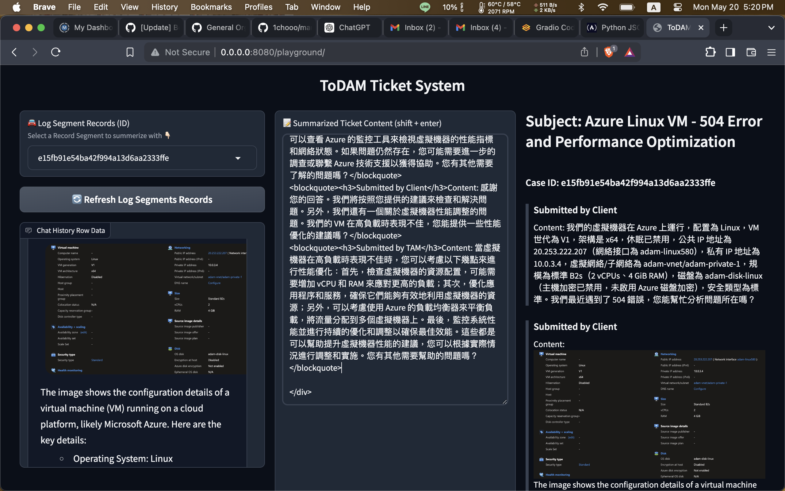

# ToDAM Ticket System   <!-- omit in toc -->


The frontend with gradio and combined with the API endpoints for the ticket system.

## Table of Contents   <!-- omit in toc -->
- [Developing Requirements](#developing-requirements)
- [Required Dependencies](#required-dependencies)
  - [Build `venv` for **MacOS**](#build-venv-for-macos)
  - [Build `venv` for **Windows**](#build-venv-for-windows)
  - [Run web app](#run-web-app)
- [Deployment](#deployment)
  - [Build the docker image](#build-the-docker-image)
  - [Deploy to AWS Lambda Function with AWS CDK](#deploy-to-aws-lambda-function-with-aws-cdk)
- [Project Structure](#project-structure)
  - [`app/`](#app)
    - [`app/cases/`](#appcases)
    - [`app/controllers/`](#appcontrollers)
    - [`app/infra/`](#appinfra)
    - [`app/utils/`](#apputils)
    - [`app/views/`](#appviews)
  - [`docs/`](#docs)
  - [`scripts/`](#scripts)
- [Functions and Features](#functions-and-features)
  - [`app.py`](#apppy)
  - [`app/main.py`](#appmainpy)
  - [`app/infa/web/router.py`](#appinfawebrouterpy)
  - [Elements for the gradio app.](#elements-for-the-gradio-app)
    - [Blocks](#blocks)
    - [Header](#header)
    - [Refresh Button](#refresh-button)
    - [Log Segment Name Dropdown](#log-segment-name-dropdown)
        - [Objective:](#objective)
        - [Technical Challenges:](#technical-challenges)
        - [Proposed Changes:](#proposed-changes)
        - [Implementation Details:](#implementation-details)
        - [How to render segname name into the frontend of Ticket System](#how-to-render-segname-name-into-the-frontend-of-ticket-system)
    - [Row Chat History](#row-chat-history)
      - [The Data Structure of the Chat History](#the-data-structure-of-the-chat-history)
    - [Summarized Ticket Content](#summarized-ticket-content)
      - [Convert Row Chat History to Payload Inputs](#convert-row-chat-history-to-payload-inputs)
      - [Handling the JSON block in the content text](#handling-the-json-block-in-the-content-text)
      - [Generate the Output that the Gradio App can Display](#generate-the-output-that-the-gradio-app-can-display)
      - [Calculate the Token Usage and Cost](#calculate-the-token-usage-and-cost)
    - [Re-Generate Button](#re-generate-button)
    - [Submit Button](#submit-button)
  - [Listener for the Gradio App](#listener-for-the-gradio-app)
- [CONTACT INFO.](#contact-info)
- [License](#license)
- [Appendix](#appendix)
  - [The Output of ChatGPT-3.5 turbo](#the-output-of-chatgpt-35-turbo)
    - [Example Response](#example-response)
    - [Method to process the Response](#method-to-process-the-response)
  - [Analysis of the output from Bedrock Model](#analysis-of-the-output-from-bedrock-model)
    - [1. `data`](#1-data)
    - [2. `body`](#2-body)
    - [3. `body` - v2](#3-body---v2)
    - [4. `body[0]`](#4-body0)
    - [5. `id`, `type`, `role`, `content`](#5-id-type-role-content)
    - [6. `content[0]`](#6-content0)
    - [7. `content[0]`, `content_type`, `content_text`](#7-content0-content_type-content_text)
    - [8. `content_text_dict`](#8-content_text_dict)
    - [9. `content_subject`, `content_case_id`, `content_start_date`, `content_transcript`](#9-content_subject-content_case_id-content_start_date-content_transcript)
    - [10. `content_transcript[0]`](#10-content_transcript0)
    - [11. `submittedBy`, `content`](#11-submittedby-content)
    - [12. How to generate the output](#12-how-to-generate-the-output)

## Developing Requirements

Python version `python3.11` or later with [`poetry`](https://python-poetry.org/) to manage the dependencies.

> [!IMPORTANT]
> If you have not installed `poetry`, please install it by following the [official guide](https://python-poetry.org/docs/#installation)

## Required Dependencies

- `gradio = "^4.31.0"`
- `uvicorn = "^0.29.0"`

### Build `venv` for **MacOS**
```shell
$ python3.11 -m venv venv
$ source venv/bin/activate
$ poetry install
$ rm -rf venv     # remove the venv
```

### Build `venv` for **Windows**
```shell
$ pip install virtualenv
$ virtualenv venv
$ venv\Scripts\activate
$ poetry install
$ rmdir /s venv     # remove the venv
```

### Run web app

Edit the `.env` file with your own token. Also need to follow the mode of the web app.

```shell
$ cp .env.example .env.<MODE>
```

```shell
# Ticket System Part
DEPARTMENT_ID="MSP_ID"

# API Endpoint Part
SUBMIT_TICKET_API_URL="DEPLOYED_SUBMIT_TICKET_API_URL"
LIST_LOG_SEGMENT_API_URL="DEPLOYED_LIST_LOG_SEGMENT_API_URL"
LIST_CHAT_HISTORY_API_URL="DEPLOYED_LIST_CHAT_HISTORY_API_URL"
BEDROCK_API_URL="DEPLOYED_BEDROCK_API_URL"

# AWS CDK Part
CDK_DEFAULT_ACCOUNT="YOUR_AWS_CDK_DEFAULT_ACCOUNT"
CDK_DEFAULT_REGION="YOUR_AWS_CDK_DEFAULT_REGION"
```

Run the web app with the following command.
```shell
# run the web app in development mode
$ python app.py --port 8080 --dev
# run the web app in test mode
$ python app.py --port 8080 --test
# run the web app in production mode
$ python app.py --port 8080 --prod

# Also you can customize the port number
$ python app.py --port 8081 --dev
```

> [!NOTE]
> If you want to run the app with the `uvicorn` server, so that you can design your own API and **reload** the app, you can run the following command.
> ```shell
> $ ./scripts/run.sh
> 
> # or
> $ uvicorn app.main:app --host 0.0.0.0 --port 8080 --reload
> ```
>
> This will use the `.env` as the default configuration file.

## Deployment

with `docker` installed, you can build and run the docker image.

### Build the docker image

```shell
$ docker build -t todam-ticket-system:<TAG_NAME> .

$ docker run -p 8080:8080 todam-ticket-system:<TAG_NAME>
```

### Deploy to AWS Lambda Function with AWS CDK

With the AWS CDK, you can deploy the gradio app to the AWS Lambda function. [Serverless Machine Learning Applications with Hugging Face Gradio and AWS Lambda]

```shell
$ cdk bootstrap
$ cdk deploy
```

## Project Structure

```shell
todam-ticket-system/
├── app/
├── docs/
├── scripts/
├── .dockerignore
├── .env.example
├── .gitignore
├── app.py
├── cdk.json
├── cdk.py
├── Dockerfile
├── LICENSE
├── poetry.lock
├── pyproject.toml
├── README.md
└── requirements.txt
```

### `app/`

```shell
├── app/
│   ├── cases/
│   ├── controllers/    # we can add more more self-defined controllers here in the future
│   ├── infra/
│   ├── utils/
│   ├── views/
│   ├── __init__.py
│   └── main.py
```

#### `app/cases/`

This is the core part of the application. We can define the functions to fetch the data from the API endpoint.

```shell
├── app/
│   ├── cases/
│   │   ├── __init__.py
│   │   ├── chat_history.py
│   │   ├── segment.py
│   │   ├── submit.py
│   │   └── ticket_summarized.py
```

#### `app/controllers/`

This is the interface for the future if we need to customize the API endpoint.

```shell
├── app/
│   ├── controllers/
│   │   ├── __init__.py
│   │   └── xxx_controllers.py
```

#### `app/infra/`

This is the interface for the future if we need to customize the database or the web server. Also used when we need to launch the app with the `uvicorn` server.

```shell
├── app/
│   ├── infra/
│   │   ├── __init__.py
│   │   ├── db/
│   │   │   └── __init__.py
│   │   ├── web/
│   │   │   │   __init__.py
│   │   │   └── router.py
```


#### `app/utils/`

There are some reusable functions that we can use in the future.

```shell
├── app/
│   ├── utils/
│   │   ├── __init__.py
│   │   ├── listener.py
│   │   ├── recording_contents.py
│   │   ├── summarized.py
│   │   └── update.py
```

#### `app/views/`

This is the interface for the gradio app. We can define the components for the gradio app.

```shell
├── app/
│   ├── views/
│   │   ├── components/
│   │   │   │   __init__.py
│   │   │   │   converted.py
│   │   │   │   information.py
│   │   │   └── status_bar.py
│   │   ├── v2/             # the version 2 of the gradio app that we can rearrange the components
│   │   │   │   __init__.py
│   │   │   └── dashboard.py
│   │   ├── __init__.py
│   │   └── dashboard.py
```

### `docs/`

To provide the documentation for the project.

```shell
├── docs/
│   ├── imgs/        # the images for the documentation
│   ├── bedrock_model.md
│   └── README.md
```

### `scripts/`

The scripts to launch the app with the `uvicorn` server.

```shell
├── scripts/
│   └── run.sh
```

## Functions and Features

### `app.py`

To launch the app with the gradio app, you can use the following code. Also we have the feature to specify the mode of the app. [How to run app with gradio and use `.env`]

```python
import argparse
from pathlib import Path
from typing import Any

from dotenv import load_dotenv

from app.views.dashboard import build_playground


def main(*args: Any, **kwargs: Any,) -> None:
    parser = argparse.ArgumentParser(
        prog="todam-ticket-system",
        description="Run the server in different modes."
    )
    parser.add_argument(
        "--prod", action="store_true", 
        help="Run the server in production mode."
    )
    parser.add_argument(
        "--test", action="store_true", 
        help="Run the server in test mode."
    )
    parser.add_argument(
        "--dev", action="store_true", 
        help="Run the server in development mode."
    )
    parser.add_argument(
        "-p", "--port", type=int, default=8080,
        help="Specify the server port. Default is 8080."
    )
    
    args = parser.parse_args()

    project_root = Path(__file__).parent
    env_path = None

    if args.prod:
        env_path = project_root / ".env.prod"
    elif args.test:
        env_path = project_root / ".env.test"
    elif args.dev:
        env_path = project_root / ".env.dev"
    else:
        env_path = project_root / ".env"

    load_dotenv(env_path, override=True)

    demo = build_playground()
    demo.launch(
        server_port=args.port
    )

    return None

if __name__ == "__main__":
    main()
```

### `app/main.py`

With the `uvicorn` server, you can launch the app with the following code. [How to run app with gradio and use `.env`]

```python
import uvicorn
from fastapi import FastAPI
from mangum import Mangum

from app.infra.web.router import setup_routers

app = FastAPI()
setup_routers(app)


@app.get("/")
def hello_world() -> dict[str, str]:
    return {"message": "Hello, ToDAM Ticket System!"}


lambda_handler = Mangum(app)

if __name__ == "__main__":
    uvicorn.run(
        "app.main:app",
        host="0.0.0.0",
        port=8080,
        reload=True,
    )
```

### `app/infa/web/router.py`

To mount the gradio app to the FastAPI, you can use the following code. Also include the mock ticket routes if you want to test the API.

```python
import gradio as gr
from fastapi import FastAPI

from app.views.dashboard import build_playground


def setup_routers(app: FastAPI) -> None:
    """
    Setup routers for the application

    Args:
        - app (FastAPI): FastAPI instance

    Returns:
        - None
    """
    gr.mount_gradio_app(app, build_playground(), path="/playground")
```

### Elements for the gradio app.

> [!NOTE]
> All of the listener to advise the changes of the gradio components are assembled in the `app/utils/listener.py`. Therefore, the below part we will only concentrate on introduce "How to achieve the feature." And later the `app/utils/` will be more detailed.

#### Blocks

The outermost container that can contain multiple `Component`.

```python
# app/views/dashboard.py
with gr.Blocks(
    title='ToDAM Ticket System',
) as demo:
```

#### Header

The header component that displays the title.

```python
# app/views/dashboard.py
gr.HTML("<h1 align=center>ToDAM Ticket System</h1>")
```

#### Refresh Button

Once we launch the app, we need to fetch the data from the API endpoint. We can use the refresh button as a trigger to fetch the data. (Gradio needs the event to trigger the function; it does not have the `onload` event. Therefore, we need to use the refresh button to fetch the data.)

```python
# app/views/dashboard.py
refresh_btn = gr.Button(
    variant="secondary",
    value="🔄 Refresh Log Segments Records",
)
```

Once the user clicks the refresh button, it fetches the data from the API endpoint.

```python
# app/utils/listener.py
refresh_btn.click(
    fn=get_segments,
    inputs=[log_segment_id],
    outputs=[log_segment_id],
)
```

The case of the refresh button is to fetch the data from the API endpoint. Then we will use the log segment Name [How to convert Log Segment ID and Log Segment Name] to fetch the chat history. And make it to the format that we can display on the gradio app.

```python
# app/cases/segment.py
def get_segment_names(
        log_segment_name: gr.Dropdown) -> tuple[gr.Dropdown, gr.Dropdown, str]:
    """
    Get segment names from the API and get the map of segment_id to segment_name

    Args:
        - log_segment_name: The gradio Dropdown object as the trigger to get the segment names

    Returns:
        - log_segment_name: The updated log_segment_name Dropdown object
        - segment_id_name_map_str: The map of segment_id to segment_name in JSON string
    """
    gr.Info("""Please click on the "🔄 Refresh Log Segments Records" button to get the latest log segment records""")

    list_log_segment_api_url: str = os.environ.get('LIST_LOG_SEGMENT_API_URL')

    headers: dict = {
    }
    payload: dict = {
    }

    response: requests.Response = requests.request(
        method="GET", url=list_log_segment_api_url, 
        headers=headers, data=payload
    )
    if response.status_code == 200:
        data = json.loads(response.text)

    segment_names = [segment["segment_name"] for segment in data["segments"]]
    # TODO: Handle the enrolled group ids to display the group name
    group_ids = [segment["group_id"] for segment in data["segments"]]

    segment_id_name_map = {
        segment["segment_id"]: segment["segment_name"] for segment in data["segments"]
    }
    segment_id_name_map_str = json.dumps(
        segment_id_name_map, ensure_ascii=False, indent=4
    )

    log_segment_name = gr.Dropdown(
        label="🚘 Log Segment Records (Name)",
        info="Select a Record Segment to summerize with 👇🏻",
        value=segment_names[0],
        choices=segment_names,
        interactive=True,
        multiselect=None,
    )

    return log_segment_name, segment_id_name_map_str
```

> [!NOTE]
> There is more TODOs that we can add the feature to display the group name. We can add the feature in the future. We have to design how to enroll at first. Also we need the capability to handle the dropdown is empty. We have to decide what to return to gradio.

#### Log Segment Name Dropdown

The dropdown component that allows the user to select the log segment Name. And it fetches the data from the API endpoint.

```python
# app/views/dashboard.py
log_segment_name = gr.Dropdown(
    label="🚘 Log Segment Records (Name)",
    info="Select a Record Segment to summerize with 👇🏻",
    interactive=True,
    multiselect=None,
)
```

###### Objective:
Currently, the Ticket System's functionality triggers the retrieval of Row Chat History and Call Summarized Content using segment_log_id. However, using Segment Name for queries would be more meaningful for clients and help users understand what each Segment represents. Therefore, we need to manually create a converter to enable querying related data using Segment Name.

###### Technical Challenges:
Since we currently use the Segment API to obtain both Segment id and Segment Name, we need to utilize this API to map the relationship between them. However, the existing Gradio interface doesn't provide this functionality. Thus, we need to implement a custom converter to achieve this requirement.

###### Proposed Changes:

1. Create a mapping structure to store the relationship between Segment Name and Segment id.
2. Modify the current design to use Segment Name as the trigger for retrieving Row Chat History and Call Summarized Content.
3. Define a converter to allow querying using Segment Name.

###### Implementation Details:

**Cases:**

1. **Refresh Button**: Clicking the refresh button will fetch the relationship between Segment Name and Segment id, and display the list of Segment Names in a dropdown menu.
2. **Storage Section**: Add a new section (using gradio.Code) to store the mapping between Segment Name and Segment id. This mapping should be kept invisible to users.
3. **Trigger Update**: Update the existing trigger to query using Segment Name instead of Segment id, and include the mapping of Segment id and Segment Name as part of the trigger.
4. **Converter Definition**: Define a converter to facilitate querying Segment id using Segment Name.

**Expected Outcome:**

1. The Segment ID dropdown will be removed from the interface, allowing users to query by Segment Name instead.
2. The frontend load time may increase, which will require further investigation.

**Cases to Modify:**

- `segment/get_segments()`
- `ticket_summarized/get_summarized_ticket_content()`
- `submit/send_summarized_ticket_content()`
- `chat_history/get_row_chat_history()`

> [!NOTE]
> ##### How to convert Log Segment ID and Log Segment Name
> 
> ###### Objective:
> 
> Currently, the Ticket System's functionality triggers the retrieval of Row Chat History and Call Summarized Content using segment_log_id. However, using Segment Name for queries would be more meaningful for clients and help users understand what each Segment represents. Therefore, we need to manually create a converter to enable querying related data using Segment Name.
> 
> ###### Technical Challenges:
> 
> Since we currently use the Segment API to obtain both Segment id and Segment Name, we need to utilize this API to map the relationship between them. However, the existing Gradio interface doesn't provide this functionality. Thus, we need to implement a custom converter to achieve this requirement.
> 
> ###### Proposed Changes:
> 
> 1. Create a mapping structure to store the relationship between Segment Name and Segment id.
> 2. Modify the current design to use Segment Name as the trigger for retrieving Row Chat History and Call Summarized Content.
> 3. Define a converter to allow querying using Segment Name.
> 
> ###### Implementation Details:
> 
> **Cases:**
> 
> 1. **Refresh Button**: Clicking the refresh button will fetch the relationship between Segment Name and Segment id, and display the list of Segment Names in a dropdown menu.
> 2. **Storage Section**: Add a new section (using gradio.Code) to store the mapping between Segment Name and Segment id. This mapping should be kept invisible to users.
> 3. **Trigger Update**: Update the existing trigger to query using Segment Name instead of Segment id, and include the mapping of Segment id and Segment Name as part of the trigger.
> 4. **Converter Definition**: Define a converter to facilitate querying Segment id using Segment Name.
> 
> **Expected Outcome:**
> 
> 1. The Segment ID dropdown will be removed from the interface, allowing users to query by Segment Name instead.
> 2. The frontend load time may increase, which will require further investigation.
> 
> **Cases to Modify:**
> 
> - `segment/get_segments()`
> - `ticket_summarized/get_summarized_ticket_content()`
> - `submit/send_summarized_ticket_content()`
> - `chat_history/get_row_chat_history()`
>
> ###### Implementation Result
> 
> 1. To convert the log segment ID and log segment Name, we need to have the hidden components to store the message type and the id name comparison when we click the refresh button. [Refresh Button]
> 
> 
> ```python
> # app/views/components/converted.py
> import gradio as gr
> 
> 
> def get_hidden_info_converted() -> tuple[gr.Markdown, gr.Code]:
>     """
>     Returns the hidden fields for the comparison.
> 
>     Args:
>         - None
> 
>     Returns:
>         - message_type (gr.Markdown): The message type
>         - id_name_comparison (gr.Code): The id name comparison
>     """
>     message_type = gr.Markdown(
>         value="🧪 Test Type: Playground",
>         visible=False,
>     )
> 
>     id_name_comparison = gr.Code(
>         value="",
>         language="json",
>         visible=False,
>     )
> 
>     return message_type, id_name_comparison
> 
> message_type, id_name_comparison = get_hidden_info_converted()
> ```
> 
> 3. Once we got the information that we stored in the hidden components, we can convert the log segment ID and log segment Name with the below function.
> 
> ```python
> # app/utils/update.py
> import json
> 
> 
> def render_segment_id(
>         log_segment_name: str, id_name_comparison: str) -> str | None:
>     """
>     Get the segment id by segment name
> 
>     Args:
>         - log_segment_name (str): The segment name
>         - id_name_comparison (str): The id_name_comparison json string
> 
>     Returns:
>         - str: The segment id | None
>     """
>     
>     id_name_comparison_dict: dict = json.loads(id_name_comparison)    # dict
> 
>     for id, time_range in id_name_comparison_dict.items():
>         if time_range == log_segment_name:
>             return id
>     return None
> ```

###### How to render segname name into the frontend of Ticket System


#### Row Chat History

```python
# app/views/dashboard.py
row_chat_history = gr.Chatbot(
    label="Chat History Row Data",
    show_label=True,
)
```

Once the user selects the Log Segment Name, it fetches the data from the API endpoint.

```python
# app/utils/listener.py
log_segment_name.change(
    fn=get_row_chat_history,
    inputs=[log_segment_name, id_name_comparison],
    outputs=[row_chat_history, message_type],
)
```

If the user selects the log segment Name, it fetches the chat history from the API endpoint. And ready to call the Bedrock Model API to get the summerized content.

```python
# app/cases/chat_history.py
import json
import os

import requests

from app.utils.recording_contents import (clean_recording_markers,
                                          extract_chat_history)
from app.utils.update import render_segment_id

def get_row_chat_history(
        log_segment_name: str, id_name_comparison: str) -> tuple[tuple[str, str], str]:
    """
    Get the chat history of the segment

    Args:
        - log_segment_name: the name of the segment
        - id_name_comparison: the comparison of the segment name and id

    Returns:
        - row_chat_history: the chat history of the segment
        - message_types: the types of the messages
    """

    log_segment_id           : str = render_segment_id(log_segment_name, id_name_comparison)
    list_chat_history_api_url: str = os.environ.get('LIST_CHAT_HISTORY_API_URL')

    url = f"{list_chat_history_api_url}/messages?segment_id={log_segment_id}"
    headers: dict = {}
    payload: dict = {}
    data: dict = {}

    response: requests.Response = requests.request(
        method="GET", url=url, 
        headers=headers, data=payload
    )
    if response.status_code == 200:
        data = json.loads(response.text)

    mesages: list[dict] = data["messages"]
    segment_contents: list[dict] = clean_recording_markers(mesages)

    row_chat_history, message_types = extract_chat_history(segment_contents)

    return row_chat_history, message_types
```

> [!NOTE]
> There is a TODO that we need to have the capability to handle the dropdown is empty. We have to decide what to return to gradio.

##### The Data Structure of the Chat History

We have to meet the requirements of the gradio app. Therefore, we have to convert the data structure to the format that the gradio app can display.

```python
((None, "Customer sayings"), ("TAM sayings", None))
```

#### Summarized Ticket Content

We have the components to display the summarized contents with the row chat history as the trigger.

```python
# app/views/dashboard.py
with gr.Row():
    summarized_ticket_conent = gr.Textbox(
        interactive=True,
        label="📝 Summarized Ticket Content (shift + enter)",
        render=True,
        value="""<blockquote>Please click on the "🔄 Refresh Log Segments Records" button to get the latest log segment records.</blockquote>""",
    )

    with gr.Row():
        with gr.Column():
            preview_summarized_ticket_subject = gr.HTML(
                value="""<h1>Subject: </h1>""",
            )
        with gr.Column():
            preview_summarized_ticket_content = gr.HTML(
                value="""<blockquote>Please click on the "🔄 Refresh Log Segments Records" button to get the latest log segment records.</blockquote>""",
            )
```

Once the chat history is ready, we can call the Bedrock Model API directly to get the summarized content.

```python
row_chat_history.change(
    fn=get_summarized_ticket_content,
    inputs=[log_segment_name, row_chat_history, message_type],
    outputs=[
        preview_summarized_ticket_subject, preview_summarized_ticket_content, 
        summarized_ticket_conent, token_usage, token_cost
    ],
)
```

> [!NOTE]
> We have disign the tool to render the summarized ticket content to the format of `HTML`. Also it's also the editor to edit the content. That we can update the content instantly when we want to edit the summarized content.
> 
> ```python
> # app/utils/update.py
> def render_preview(summarized_ticket_conent: str) -> str:
>     prev_summarized_ticket_content = summarized_ticket_conent
>     return prev_summarized_ticket_content
> ```


We have the cases to fetch the data from the Bedrock Model API [Appendix -- Analysis of the output from Bedrock Model]. And we can calculate the token usage and cost.

```python
# app/cases/ticket_summarized.py
import json
import os

import gradio as gr
import requests
from requests.models import Response

from app.utils.summarized import (calculate_token_cost, extract_payload_inputs,
                                  format_summarized_transcripts, extract_content_text)


def get_summarized_ticket_content(
        log_segment_name: str, row_chat_history: tuple[str, str], 
        message_types: str) -> tuple[str, str, str, str, str]:
    """
    Get the summarized ticket content from the Bedrock API.
    Also calculate the token usage and cost.

    Args:
        - log_segment_name (str): The name of the log segment.
        - id_name_comparison (str): The comparison between the ID and name.
        - row_chat_history (tuple[str, str]): The chat history.
        - message_types (str): The message types.

    Returns:
        - preview_subject_title (str): The subject of the ticket.
        - preview_summerized_ticket_content (str): The previewiew summarized ticket content.
        - summerized_ticket_content (str): The summarized ticket content.
        - token_usage (str): The token usage.
        - token_cost (str): The token cost.
    """

    gr.Info("""Please wait for the model to finish summarizing before operating on the screen! 🙏🏻""")

    COST_PER_INPUT_TOKEN : float =  3.00 / 1_000_000
    COST_PER_OUTPUT_TOKEN: float = 15.00 / 1_000_000

    bedrock_api_url: str = os.environ.get('BEDROCK_API_URL')

    headers: dict = {
        'Content-Type': 'application/json'
    }

    payload_inputs: list[dict] = extract_payload_inputs(
        row_chat_history, message_types
    )
    payload: str = json.dumps({"input": payload_inputs})     # 要再包一層 input

    response: Response = requests.request(
        method="POST", 
        url=bedrock_api_url, 
        headers=headers,
        data=payload,
    )

    data = []

    if response.status_code == 200:
        data: dict = json.loads(response.text)
    elif response.status_code == 400:
        advice = json.loads(response.text)["advice"]
        raise gr.Error(f"Error: {advice}")
    elif response.status_code == 500:
        advice = json.loads(response.text)["advice"]
        raise gr.Error(f"Error: {advice}")
    else:
        advice = json.loads(response.text)["advice"]
        raise gr.Error(f"Error: {advice}")
    
    body = json.loads(data["body"])

    if type(body) == list:
        body = body[0]
    elif type(body) == dict:
        pass
    else :
        return """Error: the output of data["body"] is not a list or dict"""

    content_text = extract_content_text(body)

    preview_subject_title, summerized_ticket_content = format_summarized_transcripts(
        log_segment_name, content_text
    )
    token_usage, token_cost = calculate_token_cost(
        body, COST_PER_INPUT_TOKEN, COST_PER_OUTPUT_TOKEN
    )
    preview_summerized_ticket_content = summerized_ticket_content
    
    return (preview_subject_title, preview_summerized_ticket_content, 
            summerized_ticket_content, token_usage, token_cost)
```

> [!NOTE]
>
> We have the error handling here that we can raise the error when the response status code we get from model API is not 200, we will give the advice of solution to the user. Also we have the error handling that if the format of the response [Appendix -- Analysis of the output from Bedrock Model] is not the type we expected, we still can display the results to the user [Handling the JSON block in the content text]

##### Convert Row Chat History to Payload Inputs

We have to convert the row chat history to the format that the Bedrock Model API can accept.

```python
# app/utils/summarized.py
def extract_payload_inputs(
        row_chat_history: tuple[str, str], message_types: str) -> list[dict]:
    """
    Extracts the payload inputs from the given chat history and message types.
    Also convert the message types to a list.

    Args:
        - row_chat_history (tuple[str, str]): The chat history.
        - message_types (str): The message types.

    Returns:
        - payload_inputs (list[dict]): A list of payload inputs 
        containing message type, user type, and content.
    """

    payload_inputs = []
    current_user_type = None
    message_types_list = convert_message_types_to_list(message_types)

    for i in range(len(row_chat_history)):
        tam_message, client_message = row_chat_history[i]
        message_type = message_types_list[i]
        if tam_message:
            current_user_type = "TAM"
            content = tam_message
        elif client_message:
            current_user_type = "Client"
            content = client_message
        else:
            continue    # Skip recording messages
        payload_inputs.append({
            "message_type": message_type,
            "user_type"   : current_user_type,
            "content"     : content
        })
        
    return payload_inputs
```

> [!NOTE]
> The format of input that Bedrock Model API can accept is as below.
> 
> ```python
> {"input": payload_inputs}
> ```
>
> We need to make store the inputs into the "input" key. Therefore, we have to convert the inputs to the format that the Bedrock Model API can accept.


##### Handling the JSON block in the content text

If we want to handle the JSON block in the content text, we can use the following code.

```python
# app/utils/summarized.py
def extract_content_text(body: dict) -> dict:
    """
    Extracts the content text from the given body.
    The main goal is handling the JSON block in the content text.

    Args:
        - body (dict): A dictionary containing the content text.

    Returns:
        - content_text (dict): The content text dictionary.
    """

    content: str = body["content"][0]   # body["content"] is a list
    
    JSON_BLOCK_START    : str = "```json"
    BLOCK_START         : str = "```"
    BLOCK_END           : str = "```"
    JSON_BLOCK_START_LEN: int = len(JSON_BLOCK_START)
    BLOCK_START_LEN     : int = len(BLOCK_START)
    BLOCK_END_LEN       : int = len(BLOCK_END)

    if content["text"].startswith(JSON_BLOCK_START) and content["text"].endswith(BLOCK_END):
        content["text"] = content["text"][JSON_BLOCK_START_LEN: -BLOCK_END_LEN].strip()
    elif content["text"].startswith(BLOCK_START) and content["text"].endswith(BLOCK_END):
        content["text"] = content["text"][BLOCK_START_LEN: -BLOCK_END_LEN].strip()
    else:
        pass    # Do nothing

    content_text: dict = json.loads(content["text"])

    return content_text
```

##### Generate the Output that the Gradio App can Display

We need to follow the format of the ticket system; therefore, the gradio app need to use `HTML` to display the content.

```python
# app/utils/summarized.py
def format_summarized_transcripts(
        log_segment_name: str, content_text: dict):
    """
    Formats the given log segment name, and content transcripts into structured HTML output.

    Args:
        - log_segment_name (str): The name of the log segment.
        - content_text (dict): The content text dictionary.

    Returns:
        - subject_title (str): The subject of the ticket.
        - summerized_ticket_content (str): The summarized ticket content.
    """

    subject: str = content_text["subject"]
    content_transcripts: list = content_text["transcript"]

    transcript_output = ""

    for i in range(len(content_transcripts)):
        transcript_output += f"<blockquote><h3>Submitted by {content_transcripts[i]['submittedBy']}</h3>{content_transcripts[i]['content']}</blockquote>\n"

    subject_title = f"<h1>Subject: {subject}</h1>"
    summerized_ticket_content = f"<div>\n<h3>Case Name: {log_segment_name}</h3>\n{transcript_output}\n</div>"

    return subject_title, summerized_ticket_content
```

##### Calculate the Token Usage and Cost

There is the interface that we can get the information of the token usage and cost.

```python
def calculate_token_cost(
        body: dict, COST_PER_INPUT_TOKEN: float = 3.00 / 1_000_000, 
        COST_PER_OUTPUT_TOKEN: float = 15.00 / 1_000_000) -> tuple[str, str]:
    """
    Calculate the total token usage and cost for a given input and output token count.

    Args:
        - body (dict): A dictionary containing usage information.
        - COST_PER_INPUT_TOKEN (float): The cost per input token. Default is `3.00 / 1_000_000` USD.
        - COST_PER_OUTPUT_TOKEN (float): The cost per output token. Default is `15.00 / 1_000_000` USD.

    Returns:
        - token_usage (str): A string describing the token usage.
        - token_cost (str): A string describing the total cost in USD.
    """

    usage: dict[int, int] = body["usage"]
    input_token : int = usage["input_tokens"]
    output_token: int = usage["output_tokens"]

    total_token: int = input_token + output_token
    total_cost: float = input_token * COST_PER_INPUT_TOKEN + output_token * COST_PER_OUTPUT_TOKEN
    token_usage = f"🔒 Token Usage: {total_token} (input: {input_token}; output: {output_token})"
    token_cost = f"💰 Token Cost: {total_cost:.2f} (USD)"

    return token_usage, token_cost
```

Then we will display the token usage and cost on the gradio app.

```python
# app/views/components/status_bar.py
def get_status_bar() -> tuple[gr.Markdown, gr.Markdown, gr.Markdown]:
    """
    Returns the status bar.

    Args:
        - None
    Returns:
        - token_cost (gr.Markdown): The token cost
        - token_usage (gr.Markdown): The token usage
        - submit_status (gr.Markdown): The submit status
    """
    token_cost = gr.Markdown(
        "💰 Token Cost:"
    )

    token_usage = gr.Markdown(
        "🔒 Token Usage:"
    )

    submit_status = gr.Markdown(
        value="🚦 Submit Status: Pending",
        line_breaks=True,
        visible=False,
    )

    return token_cost, token_usage, submit_status

# app/views/dashboard.py
token_cost, token_usage, submit_status = get_status_bar()
```

> [!NOTE]
> submit_status is now not visible because we have the banner when we submit the ticket. We can display the submit status on the banner. And we will introduce the banner in the next section. [^8]

#### Re-Generate Button

If we want to get the different summarized content, we can use the re-generate button to trigger the function.

```python
# app/views/dashboard.py
regenerate_summarized_ticket_content_btn = gr.Button(
    variant="secondary",
    value="🔄 re-generate",
)
```

We will call the `get_summarized_ticket_content()` function to get the summarized content again.

```python
# app/utils/listener.py
regenerate_summarized_ticket_content_btn.click(
    fn=get_summarized_ticket_content,
    inputs=[log_segment_name, row_chat_history, message_type],
    outputs=[
        preview_summarized_ticket_subject, preview_summarized_ticket_content, 
        summarized_ticket_conent, token_usage, token_cost
    ],
)
```

#### Submit Button

We have the button to submit the summarized content to the ECV ticket system.

```python
# app/views/dashboard.py
submit_summarized_btn = gr.Button(
    variant="primary",
    value="🕹️ Submit to Ticket System",
)
```

Once the user clicks the submit button, it will trigger the function to submit the summarized content to the API endpoint.

```python
import os

import gradio as gr
import requests

from app.utils.update import remove_subject_tag, render_segment_id


def send_summarized_ticket_content(
    ticket_subject: str, summerized_ticket_content: str, 
    log_segment_name: str, id_name_comparison: str,) -> str:
    """
    Send the summarized ticket content to the API

    Args:
        - ticket_subject (str): The subject of the ticket
        - summerized_ticket_content (str): The summarized ticket content
        - log_segment_name (str): The name of the log segment
        - id_name_comparison (str): The id_name_comparison json string

    Returns:
        - submit_status (str): The status of the submission and will be displayed in the UI
    """

    submit_ticket_api_url: str = os.environ.get('SUBMIT_TICKET_API_URL')
    department_id        : str = os.environ.get('DEPARTMENT_ID')
    log_segment_id       : str = render_segment_id(log_segment_name, id_name_comparison)
    ticket_subject       : str = remove_subject_tag(ticket_subject)

    headers: dict = {
    }

    payload: dict = {
        "ticket_subject"    : ticket_subject,
        "ticket_description": summerized_ticket_content,
        "department_id"     : department_id,
        "segment_id"        : log_segment_id
    }

    try:
        response: requests.Response = requests.request(
            method="POST", 
            url=submit_ticket_api_url, 
            headers=headers, 
            json=payload  # change data to json
        )

        if response.status_code == 200: 
            print(response.text)

        gr.Info("""🚦 Submit Status: Success !!!""")
        submit_status = "🚦 Submit Status: Success !!!"
        return submit_status
    except Exception as e:
        raise gr.Error(f"🚦 Submit Status: Failed, the error is {e}")
```

To follow the requirement of the ECV ticket system, we have to remove the subject tag before we submit the ticket.

```python
def remove_subject_tag(subject):
    return subject.replace("<h1>Subject: ", "").replace("</h1>", "")
```

To record the status of Log Segment, we can use the hidden components to store the message type and the id name comparison when we click the refresh button. [How to convert Log Segment ID and Log Segment Name]

```python
def render_segment_id(
        log_segment_name: str, id_name_comparison: str) -> str | None:
    """
    Get the segment id by segment name

    Args:
        - log_segment_name (str): The segment name
        - id_name_comparison (str): The id_name_comparison json string

    Returns:
        - str: The segment id | None
    """
    
    id_name_comparison_dict: dict = json.loads(id_name_comparison)    # dict

    for id, time_range in id_name_comparison_dict.items():
        if time_range == log_segment_name:
            return id
    return None
```

### Listener for the Gradio App

To manage the changes of the gradio components in one place, we can use the listener to listen to the changes of the components.

```python
# app/utils/listener.py
from app.cases.chat_history import get_row_chat_history
from app.cases.segment import get_segment_names
from app.cases.submit import send_summarized_ticket_content
from app.cases.ticket_summarized import get_summarized_ticket_content
from app.utils.update import render_preview


def background_listener(
        refresh_btn, log_segment_name, 
        id_name_comparison, row_chat_history, 
        message_type, summarized_ticket_conent, 
        preview_summarized_ticket_subject, 
        preview_summarized_ticket_content, 
        token_usage, token_cost, 
        regenerate_summarized_ticket_content_btn, 
        submit_summarized_btn, submit_status
    ) -> None:
    """
    Listen to the changes in the UI and trigger the appropriate functions
    
    Args:
        - refresh_btn (gr.Button): The refresh button
        - log_segment_name (gr.Select): The log segment name
        - id_name_comparison (gr.Hidden): The hidden field for the comparison
        - row_chat_history (gr.Chatbot): The chat history row data
        - message_type (gr.Hidden): The hidden field for the message type
        - summarized_ticket_conent (gr.Textbox): The summarized ticket content
        - preview_summarized_ticket_subject (gr.HTML): The preview of the summarized ticket subject
        - preview_summarized_ticket_content (gr.HTML): The preview of the summarized ticket content
        - token_usage (gr.ProgressBar): The token usage
        - token_cost (gr.ProgressBar): The token cost
        - regenerate_summarized_ticket_content_btn (gr.Button): The regenerate button
        - submit_summarized_btn (gr.Button): The submit button
        - submit_status (gr.ProgressBar): The submit status

    Returns:
        - None
    """
    refresh_btn.click(
        fn=get_segment_names,
        inputs=[log_segment_name],
        outputs=[log_segment_name, id_name_comparison],
    )
    
    log_segment_name.change(
        fn=get_row_chat_history,
        inputs=[log_segment_name, id_name_comparison],
        outputs=[row_chat_history, message_type],
    )

    summarized_ticket_conent.change(
        fn=render_preview,
        inputs=summarized_ticket_conent,
        outputs=preview_summarized_ticket_content,
    )

    row_chat_history.change(
        fn=get_summarized_ticket_content,
        inputs=[log_segment_name, row_chat_history, message_type],
        outputs=[
            preview_summarized_ticket_subject, preview_summarized_ticket_content, 
            summarized_ticket_conent, token_usage, token_cost
        ],
    )

    regenerate_summarized_ticket_content_btn.click(
        fn=get_summarized_ticket_content,
        inputs=[log_segment_name, row_chat_history, message_type],
        outputs=[
            preview_summarized_ticket_subject, preview_summarized_ticket_content, 
            summarized_ticket_conent, token_usage, token_cost
        ],
    )

    submit_summarized_btn.click(
        fn=send_summarized_ticket_content,
        inputs=[
            preview_summarized_ticket_subject, summarized_ticket_conent, 
            log_segment_name, id_name_comparison,
        ],
        outputs=submit_status,
    )
```

## CONTACT INFO.

> Cloud Engineer Intern </br>
> **Hugo ChunHo Lin**
> 
> <aside>
>   📩 E-mail: <a href="mailto:hugo970217@gmail.com">hugo970217@gmail.com</a>
> <br>
>   📩 ECV E-mail: <a href="mailto:hugo.lin@ecloudvalley.com">hugo.lin@ecloudvalley.com</a>
> <br>
>   🧳 Linkedin: <a href="https://www.linkedin.com/in/1chooo/">Hugo ChunHo Lin</a>
> <br>
>   👨🏻‍💻 GitHub: <a href="https://github.com/1chooo">1chooo</a>
>    
> </aside>

## License
Released under [Apache License](../LICENSE) by [TODAM-tw](https://github.com/TODAM-tw).

## Appendix

### The Output of ChatGPT-3.5 turbo

At first, we pick the ChatGPT-3.5 turbo as the model to summarize the content. We can use the below code to call the model API.

```python
def get_summarized_ticket_content(
        log_segment: gr.Dropdown, row_chat_history: gr.Chatbot) -> tuple[str, str]:
    _ = load_dotenv(find_dotenv())
    azure_ml_deployed_url : str = os.environ['AZURE_ML_DEPLOYED_URL']
    azure_ml_token        : str = os.environ['AZURE_ML_TOKEN']
    azure_model_deployment: str = os.environ['AZURE_MODEL_DEPLOYMENT']

    result = []
    current_user_type = None

    for item in row_chat_history:
        tam_message, client_message = item
        if tam_message:
            current_user_type = "TAM"
            content = tam_message
        elif client_message:
            current_user_type = "Client"
            content = client_message
        else:
            # Skip recording messages
            continue
        
        result.append({
            "user_type": current_user_type,
            "content": content
        })

    headers = {
        'azureml-model-deployment': azure_model_deployment,
        'authorization': f"Bearer {azure_ml_token}"
    }
    payload = str(result)

    response: Response = requests.request(
        "POST", azure_ml_deployed_url, 
        headers=headers, 
        data=payload
    )

    if response.status_code == 200:
        data: dict = json.loads(response.text)
    else:
        return "Error: Something went wrong with the API"

    result: dict = json.loads(data["result"])    # data["result"] 裡面是一個 JSON 格式的字串
    # transcript = result["transcript"]
    case_id = log_segment
    # case_id = result["caseId"]
    subject = result["subject"]

    transcript_output = ""
    for item in result['transcript']:
        transcript_output += f"<blockquote><h3>Submitted by {item['Submitted by']}</h3>Content: {item['content']}</blockquote>\n"

    subject_output = f"<h1>Subject: {subject}</h1>"
    summerized_ticket_content = f"<div>\n<h3>Case ID: {case_id}</h3>\n{transcript_output}\n</div>"
```

#### Example Response

```python
{
    "result": "{\n  \"subject\": \"Ticket regarding account upgrade\",\n  \"caseId\": null,\n  \"startDate\": null,\n  \"transcript\": [\n    {\n      \"Submitted by\": \"Customer\",\n      \"content\": \"Hello, I am having trouble upgrading my account to the premium plan. Every time I try to upgrade, it gives me an error message.\"\n    },\n    {\n      \"Submitted by\": \"TAM\",\n      \"content\": \"I apologize for the inconvenience. Can you please provide me with the exact error message you are receiving when trying to upgrade?\"\n    },\n    {\n      \"Submitted by\": \"Customer\",\n      \"content\": \"The error message says 'Payment Failed. Please check your payment details and try again.' But I have checked my payment details and they are correct.\"\n    },\n    {\n      \"Submitted by\": \"TAM\",\n      \"content\": \"Thank you for providing the error message. Let me investigate this issue further for you. Can you please provide me with your account username or email address?\"\n    },\n    {\n      \"Submitted by\": \"Customer\",\n      \"content\": \"My account username is john123.\"\n    },\n    {\n      \"Submitted by\": \"TAM\",\n      \"content\": \"Thank you for the information. I will look into your account and see what might be causing the payment failure. Please bear with me for a moment.\"\n    }\n  ]\n}"
}
```

#### Method to process the Response

1. Extract `result` from the response. (The `result` is a JSON string.)

```python
if response.status_code == 200:
    data: dict = json.loads(response.text)
else:
    return "Error: Something went wrong with the API"

result: dict = json.loads(data["result"])    # data["result"] 裡面是一個 JSON 格式的字串
```

2. Extract the `subject` from the `result`.

```python
subject = result["subject"]
```

3. Extract the `transcript` from the `result` and get the `Submitted by` and `content`.

```python
transcript_output = ""
for item in result['transcript']:
    transcript_output += f"<blockquote><h3>Submitted by {item['Submitted by']}</h3>Content: {item['content']}</blockquote>\n"
```

### Analysis of the output from Bedrock Model

#### 1. `data`

```python
bedrock_api_url       : str = os.environ['BEDROCK_API_URL']

message_types_list = convert_message_types_to_list(message_types)

result = []
current_user_type = None

for i in range(len(row_chat_history)):
    tam_message, client_message = row_chat_history[i]
    message_type = message_types_list[i]
    if tam_message:
        current_user_type = "TAM"
        content = tam_message
    elif client_message:
        current_user_type = "Client"
        content = client_message
    else:
        # Skip recording messages
        continue
    result.append({
        "message_type": message_type, # "text" or "image
        "user_type": current_user_type,
        "content": content
    })

headers = {
    'Content-Type': 'application/json'
}

payload = json.dumps({"input": result})     # 要再包一層 input

response: Response = requests.request(
    "POST", bedrock_api_url, 
    headers=headers,
    data=payload
)

data = []

if response.status_code == 200:
    data: dict = json.loads(response.text)
else:
    return "Error: Something went wrong with the API"

print(data)
print(type(data))

{
    'statusCode': 200, 
    'body': '[{"id": "msg_01YAmMKoE8ZY8kcuyncYvq6v", "type": "message", "role": "assistant", "content": [{"type": "text", "text": "{\\n  \\"subject\\": \\"Azure Linux VM Issues and Performance Optimization\\",\\n  \\"caseId\\": null,\\n  \\"startDate\\": null,\\n  \\"transcript\\": [\\n    {\\"submittedBy\\":\\"Client\\", \\"content\\":\\"We have a virtual machine running on Azure, configured as Linux, VM Generation V1, x64 architecture, hibernation disabled, public IP 20.253.222.207 (network interface adam-linux580), private IP 10.0.3.4, virtual network/subnet adam-vnet/adam-private-1, size Standard B2s (2 vCPUs, 4 GiB RAM), disk adam-disk-linux (host encryption disabled, Azure disk encryption not enabled), security type Standard. We have been encountering 504 errors recently, could you help analyze the issue?\\"},\\n    {\\"submittedBy\\":\\"Client\\", \\"content\\":\\"\\\\n\\\\nThe image shows the configuration details of a virtual machine (VM) running on a cloud platform, likely Microsoft Azure...\\"},\\n    {\\"submittedBy\\":\\"TAM\\", \\"content\\":\\"Sorry to hear you\'re encountering 504 errors. This could be related to your virtual machine\'s performance or connectivity. Please ensure your VM\'s resource utilization is reasonable and not being throttled, especially under high load. Also, check your network settings to ensure stable and unobstructed connectivity to Azure. You can review Azure\'s monitoring tools to view VM performance metrics and network status. If the issue persists, further investigation or contacting Azure technical support may be needed. Do you have any other questions?\\"},\\n    {\\"submittedBy\\":\\"Client\\", \\"content\\":\\"Thank you for your response. We will check and resolve the issue as per your suggestions. Additionally, we have another question regarding virtual machine performance tuning. Our VM performs poorly under high load, could you provide some recommendations for performance optimization?\\"},\\n    {\\"submittedBy\\":\\"TAM\\", \\"content\\":\\"When a virtual machine performs poorly under high load, you can consider the following for performance optimization: First, review the VM\'s resource allocation and potentially increase vCPUs and RAM to handle higher loads. Second, optimize your applications and services to efficiently utilize the VM\'s resources. Additionally, you can consider using Azure\'s Load Balancer to distribute traffic across multiple VMs. Finally, monitor system performance and continuously optimize and adjust for optimal performance. These are recommendations to help improve VM performance, which you can adjust and implement based on your specific situation. Do you have any other questions?\\"}\\n  ]\\n}"}], "model": "claude-3-sonnet-28k-20240229", "stop_reason": "end_turn", "stop_sequence": null, "usage": {"input_tokens": 1667, "output_tokens": 620}}]'
}
```

#### 2. `body`


```python
body = json.loads(data["body"])
print(body)
print(type(body))

[
    {
        'id': 'msg_01YAmMKoE8ZY8kcuyncYvq6v', 
        'type': 'message', 
        'role': 'assistant', 
        'content': [
            {
                'type': 'text', 
                'text': '{\n  "subject": "Azure Linux VM Issues and Performance Optimization",\n  "caseId": null,\n  "startDate": null,\n  "transcript": [\n    {"submittedBy":"Client", "content":"We have a virtual machine running on Azure, configured as Linux, VM Generation V1, x64 architecture, hibernation disabled, public IP 20.253.222.207 (network interface adam-linux580), private IP 10.0.3.4, virtual network/subnet adam-vnet/adam-private-1, size Standard B2s (2 vCPUs, 4 GiB RAM), disk adam-disk-linux (host encryption disabled, Azure disk encryption not enabled), security type Standard. We have been encountering 504 errors recently, could you help analyze the issue?"},\n    {"submittedBy":"Client", "content":"\\n\\nThe image shows the configuration details of a virtual machine (VM) running on a cloud platform, likely Microsoft Azure..."},\n    {"submittedBy":"TAM", "content":"Sorry to hear you\'re encountering 504 errors. This could be related to your virtual machine\'s performance or connectivity. Please ensure your VM\'s resource utilization is reasonable and not being throttled, especially under high load. Also, check your network settings to ensure stable and unobstructed connectivity to Azure. You can review Azure\'s monitoring tools to view VM performance metrics and network status. If the issue persists, further investigation or contacting Azure technical support may be needed. Do you have any other questions?"},\n    {"submittedBy":"Client", "content":"Thank you for your response. We will check and resolve the issue as per your suggestions. Additionally, we have another question regarding virtual machine performance tuning. Our VM performs poorly under high load, could you provide some recommendations for performance optimization?"},\n    {"submittedBy":"TAM", "content":"When a virtual machine performs poorly under high load, you can consider the following for performance optimization: First, review the VM\'s resource allocation and potentially increase vCPUs and RAM to handle higher loads. Second, optimize your applications and services to efficiently utilize the VM\'s resources. Additionally, you can consider using Azure\'s Load Balancer to distribute traffic across multiple VMs. Finally, monitor system performance and continuously optimize and adjust for optimal performance. These are recommendations to help improve VM performance, which you can adjust and implement based on your specific situation. Do you have any other questions?"}\n  ]\n}'
            }
        ], 
        'model': 'claude-3-sonnet-28k-20240229', 
        'stop_reason': 'end_turn', 
        'stop_sequence': None, 
        'usage': {
            'input_tokens': 1667, 
            'output_tokens': 620
        }
    }
]
<class 'list'>
```

#### 3. `body` - v2

```python
body = json.loads(data["body"])
if type(body) == list:
    body = body[0]
elif type(body) == dict:
    pass
else :
    return """Error: the output of data["body"] is not a list or dict"""

print(body)
print(type(body))

{
    'id': 'msg_01VKZ6aCRi8gJJdgSmRZPqYV', 
    'type': 'message', 
    'role': 'assistant', 
    'content': [
        {
            'type': 'text', 
            'text': '{\n  "subject": "Azure Linux VM Performance Issues and Optimization",\n  "caseId": null,\n  "startDate": null,\n  "transcript": [\n    {"submittedBy":"Client", "content":"We have a virtual machine running on Azure with Linux OS. It\'s a Generation V1, x64 architecture with hibernation disabled. The public IP is 20.253.222.207 (network interface adam-linux580), private IP is 10.0.3.4, virtual network/subnet is adam-vnet/adam-private-1. The size is Standard B2s (2 vCPUs, 4 GiB RAM). The disk is adam-disk-linux with host encryption disabled and Azure disk encryption not enabled. The security type is Standard. We\'ve been facing 504 errors recently, could you help analyze the issue?"},\n    {"submittedBy":"Client", "content":"\\n\\nThe image shows the configuration details of a virtual machine (VM) running on a cloud platform, likely Microsoft Azure. Here are the key details:\\n\\n- Operating System: Linux\\n- VM Generation: V1\\n- VM Architecture: x64\\n- Hibernation: Disabled\\n- Public IP Address: 20.253.222.207 (Network interface adam-linux580)\\n- Private IP Address: 10.0.3.4\\n- Virtual Network/Subnet: adam-vnet/adam-private-1\\n- Size: Standard B2s (2 vCPUs, 4 GiB RAM)\\n- Disk: adam-disk-linux (Encryption at host disabled, Azure disk encryption not enabled)\\n- Security Type: Standard\\n\\nThe VM does not appear to be part of any host group, availability set, or scale set. The source image details, availability zone, capacity reservation group, and disk controller type are not specified in the provided information."},\n    {"submittedBy":"TAM", "content":"Sorry to hear you\'re facing 504 errors. This could be related to your virtual machine\'s performance or connectivity. Please ensure your VM\'s resource utilization is reasonable and not being throttled, especially under high load. Also, check your network settings to ensure a stable and unobstructed connection to Azure. You can review Azure\'s monitoring tools to view the VM\'s performance metrics and network status. If the issue persists, you may need further investigation or to contact Azure technical support for assistance. Do you have any other questions?"},\n    {"submittedBy":"Client", "content":"Thank you for your response. We will check and resolve the issue as per your suggestions. Additionally, we have another question regarding VM performance tuning. Our VM performs poorly under high load, could you provide some recommendations for performance optimization?"},\n    {"submittedBy":"TAM", "content":"When your virtual machine performs poorly under high load, you can consider the following points for performance optimization: First, check the VM\'s resource allocation and consider increasing vCPUs and RAM to handle higher loads. Second, optimize your applications and services to efficiently utilize the VM\'s resources. Additionally, you can consider using Azure\'s Load Balancer to distribute traffic across multiple VMs. Finally, monitor system performance and continuously optimize and adjust to ensure optimal performance. These are suggestions that can help improve VM performance, and you can adjust and implement them based on your specific situation. Do you have any other questions that need assistance?"}\n  ]\n}'
        }
    ], 
    'model': 'claude-3-sonnet-28k-20240229', 
    'stop_reason': 'end_turn', 
    'stop_sequence': None, 
    'usage': {
        'input_tokens': 1668, 
        'output_tokens': 838
    }
}
```

#### 4. `body[0]`

```python
body = body[0]
print(body)
print(type(body))

{
    'id': 'msg_015xGe1raCJpSoTkqD4ZoYeA', 
    'type': 'message', 
    'role': 'assistant', 
    'content': [
        {
            'type': 'text', 
            'text': '{\n  "subject": "Azure Linux VM Performance Issues and Optimization",\n  "caseId": null,\n  "startDate": null,\n  "transcript": [\n    {"submittedBy":"Client", "content":"We have a virtual machine running on Azure configured as Linux, VM Generation V1, x64 architecture, hibernation disabled, public IP 20.253.222.207 (network interface adam-linux580), private IP 10.0.3.4, virtual network/subnet adam-vnet/adam-private-1, size Standard B2s (2 vCPUs, 4 GiB RAM), disk adam-disk-linux (host encryption disabled, Azure disk encryption not enabled), security type Standard. We have been facing 504 errors recently. Could you help analyze the issue?"},\n    {"submittedBy":"Client", "content":"\\n\\nThe image shows the configuration details of a virtual machine (VM) running on a cloud platform, likely Microsoft Azure..."},\n    {"submittedBy":"TAM", "content":"Sorry to hear about the 504 errors. This could be related to your VM\'s performance or connectivity. Ensure your VM\'s resource usage is reasonable and not restricted, especially under high load. Also, check your network settings to ensure a stable and unobstructed connection to Azure. You can review Azure monitoring tools to view VM performance metrics and network status. If the issue persists, further investigation or contacting Azure technical support may be needed."},\n    {"submittedBy":"Client", "content":"Thank you for your response. We will check and resolve the issue as per your suggestions. Additionally, we have a question regarding VM performance tuning. Our VM performs poorly under high load, could you provide some performance optimization recommendations?"},\n    {"submittedBy":"TAM", "content":"When a VM performs poorly under high load, you can consider the following for performance optimization: First, check the VM\'s resource allocation and potentially increase vCPUs and RAM to handle higher loads. Second, optimize applications and services to efficiently utilize the VM\'s resources. Third, consider using Azure Load Balancer to distribute traffic across multiple VMs. Finally, monitor system performance and continuously optimize and adjust for optimal performance. These are recommendations to help improve VM performance; adjust and implement based on your specific scenario."}\n  ]\n}'
        }
    ], 
    'model': 'claude-3-sonnet-28k-20240229', 
    'stop_reason': 'end_turn', 
    'stop_sequence': None, 
    'usage': {
        'input_tokens': 1667, 
        'output_tokens': 588
    }
}

<class 'dict'>
```

#### 5. `id`, `type`, `role`, `content`

```python
id = body["id"]
type = body["type"]
role = body["role"]
content = body["content"]
print(id)
print(type)
print(role)
print(content)
print(type(content))

msg_016ou31w7wBoWuJkwZc5uG4t
message
assistant
[
    {
        'type': 'text', 
        'text': '{\n  "subject": "Azure Linux VM Performance Issues and 504 Errors",\n  "caseId": null,\n  "startDate": null,\n  "transcript": [\n    {"submittedBy":"Client", "content":"We are running a virtual machine on Azure with the following configuration: Linux OS, VM Generation V1, x64 architecture, hibernation disabled, public IP 20.253.222.207 (network interface adam-linux580), private IP 10.0.3.4, virtual network/subnet adam-vnet/adam-private-1, size Standard B2s (2 vCPUs, 4 GiB RAM), disk adam-disk-linux (host encryption disabled, Azure disk encryption not enabled), security type Standard. We have recently encountered 504 errors. Can you help analyze the issue?"},\n    {"submittedBy":"Client", "content":"\\n\\nThe image shows the configuration details of a virtual machine (VM) running on a cloud platform, likely Microsoft Azure..."},\n    {"submittedBy":"TAM", "content":"I\'m sorry to hear you\'re encountering 504 errors. This could be related to the performance or connectivity of your virtual machine. Please ensure your VM\'s resource utilization is reasonable and not being throttled, especially during high load. Also, check your network settings to ensure a stable and unobstructed connection to Azure. You can review Azure\'s monitoring tools to view VM performance metrics and network status. If the issue persists, further investigation or contacting Azure technical support may be needed. Do you have any other questions?"},\n    {"submittedBy":"Client", "content":"Thank you for your response. We will follow your suggestions to check and resolve the issue. Additionally, we have another question regarding VM performance tuning. Our VM performs poorly under high load. Can you provide some recommendations for performance optimization?"},\n    {"submittedBy":"TAM", "content":"When a virtual machine performs poorly under high load, you can consider the following for performance optimization: First, check the VM\'s resource allocation and consider increasing vCPUs and RAM to handle higher loads. Second, optimize applications and services to efficiently utilize the VM\'s resources. Additionally, you can consider using Azure\'s load balancer to distribute traffic across multiple VMs. Finally, monitor system performance and continuously optimize and adjust for optimal performance. These are recommendations to help improve VM performance, which you can adjust and implement based on your specific situation. Do you have any other questions?"}\n  ]\n}'
    }
]
<class 'list'>
```

#### 6. `content[0]`

```python
print(content[0])
print(type(content[0]))

{
    'type': 'text', 
    'text': '{\n  "subject": "Azure Linux VM Performance Issues",\n  "caseId": null,\n  "startDate": null,\n  "transcript": [\n    {"submittedBy":"Client", "content":"我們的虛擬機器在 Azure 上運行，配置為 Linux，VM 世代為 V1，架構是 x64，休眠已禁用，公共 IP 地址為 20.253.222.207（網絡接口為 adam-linux580），私有 IP 地址為 10.0.3.4，虛擬網絡/子網絡為 adam-vnet/adam-private-1，規模為標準 B2s（2 vCPUs、4 GiB RAM），磁盤為 adam-disk-linux（主機加密已禁用，未啟用 Azure 磁盤加密），安全類型為標準。我們最近遇到了 504 錯誤，您能幫忙分析問題所在嗎？"},\n    {"submittedBy":"Client", "content":"\\n\\nThe image shows the configuration details of a virtual machine (VM) running on a cloud platform, likely Microsoft Azure. Here are the key details:\\n\\n- Operating System: Linux\\n- VM Generation: V1\\n- VM Architecture: x64\\n- Hibernation: Disabled\\n- Public IP Address: 20.253.222.207 (Network interface adam-linux580)\\n- Private IP Address: 10.0.3.4\\n- Virtual Network/Subnet: adam-vnet/adam-private-1\\n- Size: Standard B2s (2 vCPUs, 4 GiB RAM)\\n- Disk: adam-disk-linux (Encryption at host disabled, Azure disk encryption not enabled)\\n- Security Type: Standard\\n\\nThe VM does not appear to be part of any host group, availability set, or scale set. The source image details, availability zone, capacity reservation group, and disk controller type are not specified in the provided information."},\n    {"submittedBy":"TAM", "content":"很抱歉聽到您遇到 504 錯誤。這可能與您的虛擬機器的性能或連接有關。請確保您的虛擬機器的資源使用合理並且未受到任何限制，特別是在高負載時。同時，請檢查您的網絡設置，確保連接到 Azure 的網絡穩定且無阻礙。您可以查看 Azure 的監控工具來檢視虛擬機器的性能指標和網絡狀態。如果問題仍然存在，您可能需要進一步的調查或聯繫 Azure 技術支援以獲得協助。您有其他需要了解的問題嗎？"},\n    {"submittedBy":"Client", "content":"感謝您的回答。我們將按照您提供的建議來檢查和解決問題。另外，我們還有一個關於虛擬機器性能調整的問題。我們的 VM 在高負載時表現不佳，您能提供一些性能優化的建議嗎？"},\n    {"submittedBy":"TAM", "content":"當虛擬機器在高負載時表現不佳時，您可以考慮以下幾點來進行性能優化：首先，檢查虛擬機器的資源配置，可能需要增加 vCPU 和 RAM 來應對更高的負載；其次，優化應用程序和服務，確保它們能夠有效地利用虛擬機器的資源；另外，可以考慮使用 Azure 的負載均衡器來平衡負載，將流量分配到多個虛擬機器上。最後，監控系統性能並進行持續的優化和調整以確保最佳效能。這些都是可以幫助提升虛擬機器性能的建議，您可以根據實際情況進行調整和實施。您有其他需要幫助的問題嗎？"}\n  ]\n}'
}
<class 'dict'>
```

#### 7. `content[0]`, `content_type`, `content_text`

```python
content = content[0]
content_type = content["type"]
content_text = content["text"]
print(content_type)
print(content_text)
print(type(content_text))

text
{
    "subject": "Azure Linux VM Performance Issues and Optimization",
    "caseId": null,
    "startDate": null,
    "transcript": [
        {
            "submittedBy":"Client", 
            "content":"我們的虛擬機器在 Azure 上運行，配置為 Linux，VM 世代為 V1，架構是 x64，休眠已禁用，公共 IP 地址為 20.253.222.207（網絡接口為 adam-linux580），私有 IP 地址為 10.0.3.4，虛擬網絡/子網絡為 adam-vnet/adam-private-1，規模為標準 B2s（2 vCPUs、4 GiB RAM），磁盤為 adam-disk-linux（主機加密已禁用，未啟用 Azure 磁盤加密），安全類型為標準。我們最近遇到了 504 錯誤，您能幫忙分析問題所在嗎？"
        },
        {
            "submittedBy":"Client", 
            "content":"\n\nThe image shows the configuration details of a virtual machine (VM) running on a cloud platform, likely Microsoft Azure..."
        },
        {
            "submittedBy":"TAM", 
            "content":"很抱歉聽到您遇到 504 錯誤。這可能與您的虛擬機器的性能或連接有關。請確保您的虛擬機器的資源使用合理並且未受到任何限制，特別是在高負載時。同時，請檢查您的網絡設置，確保連接到 Azure 的網絡穩定且無阻礙。您可以查看 Azure 的監控工具來檢視虛擬機器的性能指標和網絡狀態。如果問題仍然存在，您可能需要進一步的調查或聯繫 Azure 技術支援以獲得協助。"
        },
        {
            "submittedBy":"Client", 
            "content":"感謝您的回答。我們將按照您提供的建議來檢查和解決問題。另外，我們還有一個關於虛擬機器性能調整的問題。我們的 VM 在高負載時表現不佳，您能提供一些性能優化的建議嗎？"
        },
        {
            "submittedBy":"TAM", 
            "content":"當虛擬機器在高負載時表現不佳時，您可以考慮以下幾點來進行性能優化：首先，檢查虛擬機器的資源配置，可能需要增加 vCPU 和 RAM 來應對更高的負載；其次，優化應用程序和服務，確保它們能夠有效地利用虛擬機器的資源；另外，可以考慮使用 Azure 的負載均衡器來平衡負載，將流量分配到多個虛擬機器上。最後，監控系統性能並進行持續的優化和調整以確保最佳效能。這些都是可以幫助提升虛擬機器性能的建議，您可以根據實際情況進行調整和實施。"
        }
    ]
}
<class 'str'>
```

#### 8. `content_text_dict`

```python
content_text_dict = json.loads(content_text)   # dict
print(content_text_dict)
print(type(content_text_dict))

{
    'subject': 'Azure Linux VM 504 Error and Performance Tuning', 
    'caseId': None, 
    'startDate': None, 
    'transcript': [
        {
            'submittedBy': 'Client', 
            'content': 'We have a virtual machine running on Azure, configured with Linux, VM Generation V1, x64 architecture, hibernation disabled, public IP 20.253.222.207 (network interface adam-linux580), private IP 10.0.3.4, virtual network/subnet adam-vnet/adam-private-1, size Standard B2s (2 vCPUs, 4 GiB RAM), disk adam-disk-linux (host encryption disabled, Azure disk encryption not enabled), security type Standard. We have been experiencing 504 errors recently. Can you help analyze the issue?'
        }, 
        {
            'submittedBy': 'Client', 
            'content': '\n\nThe image shows the configuration details of a virtual machine (VM) running on a cloud platform, likely Microsoft Azure...'
        }, 
        {
            'submittedBy': 'TAM', 
            'content': "Sorry to hear about the 504 errors. This could be related to your VM's performance or connectivity. Ensure your VM resources are reasonably utilized and not restricted, especially under high load. Also, check your network settings and ensure a stable, unobstructed connection to Azure. You can review Azure monitoring tools to view VM performance metrics and network status. If the issue persists, further investigation or contacting Azure technical support may be needed."
        }, 
        {
            'submittedBy': 'Client', 
            'content': 'Thank you for the response. We will check and resolve the issue based on your suggestions. Additionally, we have a question about VM performance tuning. Our VM performs poorly under high load. Can you provide recommendations for performance optimization?'
        }, 
        {
            'submittedBy': 'TAM', 
            'content': 'When a VM performs poorly under high load, you can consider: First, checking resource allocation and increasing vCPU and RAM to handle higher loads; second, optimizing applications and services to efficiently utilize VM resources; also, consider using Azure Load Balancer to distribute traffic across multiple VMs. Finally, monitor system performance and continuously optimize and adjust for best performance. These are recommendations to help improve VM performance based on your specific situation.'
        }
    ]
}
<class 'dict'>
```

#### 9. `content_subject`, `content_case_id`, `content_start_date`, `content_transcript`

```python
content_subject = content_text_dict["subject"]
content_case_id = content_text_dict["caseId"]
content_start_date = content_text_dict["startDate"]
content_transcript = content_text_dict["transcript"]
print(content_subject)
print(content_case_id)
print(content_start_date)
print(content_transcript)
print(type(content_transcript))

Azure Linux VM 504 Error and Performance Tuning
None
None
[
    {
        'submittedBy': 'Client', 
        'content': 'We have a virtual machine running on Azure, configured as Linux, VM Generation V1, x64 architecture, hibernation disabled, public IP 20.253.222.207 (network interface adam-linux580), private IP 10.0.3.4, virtual network/subnet adam-vnet/adam-private-1, size Standard B2s (2 vCPUs, 4 GiB RAM), disk adam-disk-linux (host encryption disabled, Azure disk encryption not enabled), security type Standard. We have been encountering 504 errors recently, could you help analyze the issue?'
    }, 
    {
        'submittedBy': 'Client', 
        'content': '\n\nThe image shows the configuration details of a virtual machine (VM) running on a cloud platform, likely Microsoft Azure. Here are the key details:\n\n- Operating System: Linux\n- VM Generation: V1\n- VM Architecture: x64\n- Hibernation: Disabled\n- Public IP Address: 20.253.222.207 (Network interface adam-linux580)\n- Private IP Address: 10.0.3.4\n- Virtual Network/Subnet: adam-vnet/adam-private-1\n- Size: Standard B2s (2 vCPUs, 4 GiB RAM)\n- Disk: adam-disk-linux (Encryption at host disabled, Azure disk encryption not enabled)\n- Security Type: Standard\n\nThe VM does not appear to be part of any host group, availability set, or scale set. The source image details, availability zone, capacity reservation group, and disk controller type are not specified in the provided information.'
    }, 
    {
        'submittedBy': 'TAM', 
        'content': "Sorry to hear you're encountering 504 errors. This could be related to the performance or connectivity of your virtual machine. Please ensure your VM's resource utilization is reasonable and not hitting any limits, especially under high load. Also, check your network settings to ensure stable and unhindered connectivity to Azure. You can review Azure's monitoring tools to view the VM's performance metrics and network status. If the issue persists, you may need further investigation or to contact Azure technical support for assistance. Do you have any other questions?"
    }, 
    {
        'submittedBy': 'Client', 
        'content': 'Thank you for your response. We will follow your suggestions to check and resolve the issue. Additionally, we have another question regarding VM performance tuning. Our VM performs poorly under high load, could you provide some recommendations for performance optimization?'
    }, 
    {
        'submittedBy': 'TAM', 
        'content': "When a virtual machine performs poorly under high load, you can consider the following points for performance optimization: First, check the VM's resource allocation and potentially increase vCPU and RAM to handle higher loads. Second, optimize applications and services to efficiently utilize the VM's resources. Additionally, you can consider using Azure's load balancer to distribute traffic across multiple VMs. Finally, monitor system performance and continuously optimize and adjust for best performance. These are recommendations that can help improve VM performance, and you can adjust and implement them based on your specific situation. Do you have any other questions?"
    }
]
<class 'list'>
```

#### 10. `content_transcript[0]`

```python
content_transcript = content_transcript[0]
print(content_transcript)
print(type(content_transcript))

{
    'submittedBy': 'Client', 
    'content': 'We have a virtual machine running on Azure configured as Linux, VM Generation V1, x64 architecture, hibernation disabled, public IP 20.253.222.207 (network interface adam-linux580), private IP 10.0.3.4, virtual network/subnet adam-vnet/adam-private-1, size Standard B2s (2 vCPUs, 4 GiB RAM), disk adam-disk-linux (host encryption disabled, Azure disk encryption not enabled), security type Standard. We have been encountering 504 errors recently, can you help analyze the issue?'
}
<class 'dict'>
```

#### 11. `submittedBy`, `content`

```python
print(content_transcript["submittedBy"])
print(content_transcript["content"])

Client
Our virtual machine is running on Azure, configured as Linux, VM Generation V1, x64 architecture, hibernation disabled, public IP 20.253.222.207 (network interface adam-linux580), private IP 10.0.3.4, virtual network/subnet adam-vnet/adam-private-1, size Standard B2s (2 vCPUs, 4 GiB RAM), disk adam-disk-linux (host encryption disabled, Azure disk encryption not enabled), security type Standard. We've been encountering 504 errors recently, could you help analyze the issue?
```

#### 12. How to generate the output

```python
case_id = log_segment
subject = content_subject


transcript_output = ""

for i in range(len(content_transcript)):
    transcript_output += f"<blockquote><h3>Submitted by {content_transcript[i]['submittedBy']}</h3>Content: {content_transcript[i]['content']}</blockquote>\n"

subject_output = f"<h1>Subject: {subject}</h1>"
summerized_ticket_content = f"<div>\n<h3>Case ID: {case_id}</h3>\n{transcript_output}\n</div>"
```




[Json.cn]: https://www.json.cn/
[Serverless Machine Learning Applications with Hugging Face Gradio and AWS Lambda]: https://www.philschmid.de/serverless-gradio
[philschmid/serverless-machine-learning/gradio-aws-lambda-transformers]: https://github.com/philschmid/serverless-machine-learning/tree/main/gradio-aws-lambda-transformers
[How to convert Log Segment ID and Log Segment Name]: #how-to-convert-log-segment-id-and-log-segment-name
[How to run app with gradio and use `.env`]: #run-web-app
[Refresh Button]: #refresh-button
[Appendix -- Analysis of the output from Bedrock Model]: #analysis-of-the-output-from-bedrock-model
[Handling the JSON block in the content text]: #handling-the-json-block-in-the-content-text
