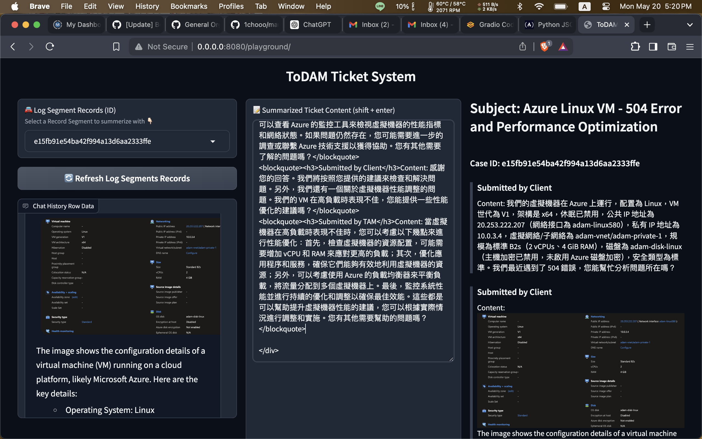

# Analysis of the output from Bedrock Model

## `data`

```python
bedrock_api_url       : str = os.environ['BEDROCK_API_URL']

message_types_list = convert_message_types_to_list(message_types)

result = []
current_user_type = None

for i in range(len(row_chat_history)):
    tam_message, client_message = row_chat_history[i]
    message_type = message_types_list[i]
    if tam_message:
        current_user_type = "TAM"
        content = tam_message
    elif client_message:
        current_user_type = "Client"
        content = client_message
    else:
        # Skip recording messages
        continue
    result.append({
        "message_type": message_type, # "text" or "image
        "user_type": current_user_type,
        "content": content
    })

headers = {
    'Content-Type': 'application/json'
}

payload = json.dumps({"input": result})     # 要再包一層 input

response: Response = requests.request(
    "POST", bedrock_api_url, 
    headers=headers,
    data=payload
)

data = []

if response.status_code == 200:
    data: dict = json.loads(response.text)
else:
    return "Error: Something went wrong with the API"

print(data)
print(type(data))
```

### Output

```python
{
    'statusCode': 200, 
    'body': '[{"id": "msg_01YAmMKoE8ZY8kcuyncYvq6v", "type": "message", "role": "assistant", "content": [{"type": "text", "text": "{\\n  \\"subject\\": \\"Azure Linux VM Issues and Performance Optimization\\",\\n  \\"caseId\\": null,\\n  \\"startDate\\": null,\\n  \\"transcript\\": [\\n    {\\"submittedBy\\":\\"Client\\", \\"content\\":\\"We have a virtual machine running on Azure, configured as Linux, VM Generation V1, x64 architecture, hibernation disabled, public IP 20.253.222.207 (network interface adam-linux580), private IP 10.0.3.4, virtual network/subnet adam-vnet/adam-private-1, size Standard B2s (2 vCPUs, 4 GiB RAM), disk adam-disk-linux (host encryption disabled, Azure disk encryption not enabled), security type Standard. We have been encountering 504 errors recently, could you help analyze the issue?\\"},\\n    {\\"submittedBy\\":\\"Client\\", \\"content\\":\\"\\\\n\\\\nThe image shows the configuration details of a virtual machine (VM) running on a cloud platform, likely Microsoft Azure...\\"},\\n    {\\"submittedBy\\":\\"TAM\\", \\"content\\":\\"Sorry to hear you\'re encountering 504 errors. This could be related to your virtual machine\'s performance or connectivity. Please ensure your VM\'s resource utilization is reasonable and not being throttled, especially under high load. Also, check your network settings to ensure stable and unobstructed connectivity to Azure. You can review Azure\'s monitoring tools to view VM performance metrics and network status. If the issue persists, further investigation or contacting Azure technical support may be needed. Do you have any other questions?\\"},\\n    {\\"submittedBy\\":\\"Client\\", \\"content\\":\\"Thank you for your response. We will check and resolve the issue as per your suggestions. Additionally, we have another question regarding virtual machine performance tuning. Our VM performs poorly under high load, could you provide some recommendations for performance optimization?\\"},\\n    {\\"submittedBy\\":\\"TAM\\", \\"content\\":\\"When a virtual machine performs poorly under high load, you can consider the following for performance optimization: First, review the VM\'s resource allocation and potentially increase vCPUs and RAM to handle higher loads. Second, optimize your applications and services to efficiently utilize the VM\'s resources. Additionally, you can consider using Azure\'s Load Balancer to distribute traffic across multiple VMs. Finally, monitor system performance and continuously optimize and adjust for optimal performance. These are recommendations to help improve VM performance, which you can adjust and implement based on your specific situation. Do you have any other questions?\\"}\\n  ]\\n}"}], "model": "claude-3-sonnet-28k-20240229", "stop_reason": "end_turn", "stop_sequence": null, "usage": {"input_tokens": 1667, "output_tokens": 620}}]'
}
```

## `body`

```python
body = json.loads(data["body"])
print(body)
print(type(body))
```

### Output

```python
[
    {
        'id': 'msg_01YAmMKoE8ZY8kcuyncYvq6v', 
        'type': 'message', 
        'role': 'assistant', 
        'content': [
            {
                'type': 'text', 
                'text': '{\n  "subject": "Azure Linux VM Issues and Performance Optimization",\n  "caseId": null,\n  "startDate": null,\n  "transcript": [\n    {"submittedBy":"Client", "content":"We have a virtual machine running on Azure, configured as Linux, VM Generation V1, x64 architecture, hibernation disabled, public IP 20.253.222.207 (network interface adam-linux580), private IP 10.0.3.4, virtual network/subnet adam-vnet/adam-private-1, size Standard B2s (2 vCPUs, 4 GiB RAM), disk adam-disk-linux (host encryption disabled, Azure disk encryption not enabled), security type Standard. We have been encountering 504 errors recently, could you help analyze the issue?"},\n    {"submittedBy":"Client", "content":"\\n\\nThe image shows the configuration details of a virtual machine (VM) running on a cloud platform, likely Microsoft Azure..."},\n    {"submittedBy":"TAM", "content":"Sorry to hear you\'re encountering 504 errors. This could be related to your virtual machine\'s performance or connectivity. Please ensure your VM\'s resource utilization is reasonable and not being throttled, especially under high load. Also, check your network settings to ensure stable and unobstructed connectivity to Azure. You can review Azure\'s monitoring tools to view VM performance metrics and network status. If the issue persists, further investigation or contacting Azure technical support may be needed. Do you have any other questions?"},\n    {"submittedBy":"Client", "content":"Thank you for your response. We will check and resolve the issue as per your suggestions. Additionally, we have another question regarding virtual machine performance tuning. Our VM performs poorly under high load, could you provide some recommendations for performance optimization?"},\n    {"submittedBy":"TAM", "content":"When a virtual machine performs poorly under high load, you can consider the following for performance optimization: First, review the VM\'s resource allocation and potentially increase vCPUs and RAM to handle higher loads. Second, optimize your applications and services to efficiently utilize the VM\'s resources. Additionally, you can consider using Azure\'s Load Balancer to distribute traffic across multiple VMs. Finally, monitor system performance and continuously optimize and adjust for optimal performance. These are recommendations to help improve VM performance, which you can adjust and implement based on your specific situation. Do you have any other questions?"}\n  ]\n}'
            }
        ], 
        'model': 'claude-3-sonnet-28k-20240229', 
        'stop_reason': 'end_turn', 
        'stop_sequence': None, 
        'usage': {
            'input_tokens': 1667, 
            'output_tokens': 620
        }
    }
]
<class 'list'>
```

## `body` - v2

```python
body = json.loads(data["body"])
if type(body) == list:
    body = body[0]
elif type(body) == dict:
    pass
else :
    return """Error: the output of data["body"] is not a list or dict"""

print(body)
print(type(body))
```

### Output

```python
{
    'id': 'msg_01VKZ6aCRi8gJJdgSmRZPqYV', 
    'type': 'message', 
    'role': 'assistant', 
    'content': [
        {
            'type': 'text', 
            'text': '{\n  "subject": "Azure Linux VM Performance Issues and Optimization",\n  "caseId": null,\n  "startDate": null,\n  "transcript": [\n    {"submittedBy":"Client", "content":"We have a virtual machine running on Azure with Linux OS. It\'s a Generation V1, x64 architecture with hibernation disabled. The public IP is 20.253.222.207 (network interface adam-linux580), private IP is 10.0.3.4, virtual network/subnet is adam-vnet/adam-private-1. The size is Standard B2s (2 vCPUs, 4 GiB RAM). The disk is adam-disk-linux with host encryption disabled and Azure disk encryption not enabled. The security type is Standard. We\'ve been facing 504 errors recently, could you help analyze the issue?"},\n    {"submittedBy":"Client", "content":"\\n\\nThe image shows the configuration details of a virtual machine (VM) running on a cloud platform, likely Microsoft Azure. Here are the key details:\\n\\n- Operating System: Linux\\n- VM Generation: V1\\n- VM Architecture: x64\\n- Hibernation: Disabled\\n- Public IP Address: 20.253.222.207 (Network interface adam-linux580)\\n- Private IP Address: 10.0.3.4\\n- Virtual Network/Subnet: adam-vnet/adam-private-1\\n- Size: Standard B2s (2 vCPUs, 4 GiB RAM)\\n- Disk: adam-disk-linux (Encryption at host disabled, Azure disk encryption not enabled)\\n- Security Type: Standard\\n\\nThe VM does not appear to be part of any host group, availability set, or scale set. The source image details, availability zone, capacity reservation group, and disk controller type are not specified in the provided information."},\n    {"submittedBy":"TAM", "content":"Sorry to hear you\'re facing 504 errors. This could be related to your virtual machine\'s performance or connectivity. Please ensure your VM\'s resource utilization is reasonable and not being throttled, especially under high load. Also, check your network settings to ensure a stable and unobstructed connection to Azure. You can review Azure\'s monitoring tools to view the VM\'s performance metrics and network status. If the issue persists, you may need further investigation or to contact Azure technical support for assistance. Do you have any other questions?"},\n    {"submittedBy":"Client", "content":"Thank you for your response. We will check and resolve the issue as per your suggestions. Additionally, we have another question regarding VM performance tuning. Our VM performs poorly under high load, could you provide some recommendations for performance optimization?"},\n    {"submittedBy":"TAM", "content":"When your virtual machine performs poorly under high load, you can consider the following points for performance optimization: First, check the VM\'s resource allocation and consider increasing vCPUs and RAM to handle higher loads. Second, optimize your applications and services to efficiently utilize the VM\'s resources. Additionally, you can consider using Azure\'s Load Balancer to distribute traffic across multiple VMs. Finally, monitor system performance and continuously optimize and adjust to ensure optimal performance. These are suggestions that can help improve VM performance, and you can adjust and implement them based on your specific situation. Do you have any other questions that need assistance?"}\n  ]\n}'
        }
    ], 
    'model': 'claude-3-sonnet-28k-20240229', 
    'stop_reason': 'end_turn', 
    'stop_sequence': None, 
    'usage': {
        'input_tokens': 1668, 
        'output_tokens': 838
    }
}
```

## `body[0]`

```python
body = body[0]
print(body)
print(type(body))
```

### Output

```python
{
    'id': 'msg_015xGe1raCJpSoTkqD4ZoYeA', 
    'type': 'message', 
    'role': 'assistant', 
    'content': [
        {
            'type': 'text', 
            'text': '{\n  "subject": "Azure Linux VM Performance Issues and Optimization",\n  "caseId": null,\n  "startDate": null,\n  "transcript": [\n    {"submittedBy":"Client", "content":"We have a virtual machine running on Azure configured as Linux, VM Generation V1, x64 architecture, hibernation disabled, public IP 20.253.222.207 (network interface adam-linux580), private IP 10.0.3.4, virtual network/subnet adam-vnet/adam-private-1, size Standard B2s (2 vCPUs, 4 GiB RAM), disk adam-disk-linux (host encryption disabled, Azure disk encryption not enabled), security type Standard. We have been facing 504 errors recently. Could you help analyze the issue?"},\n    {"submittedBy":"Client", "content":"\\n\\nThe image shows the configuration details of a virtual machine (VM) running on a cloud platform, likely Microsoft Azure..."},\n    {"submittedBy":"TAM", "content":"Sorry to hear about the 504 errors. This could be related to your VM\'s performance or connectivity. Ensure your VM\'s resource usage is reasonable and not restricted, especially under high load. Also, check your network settings to ensure a stable and unobstructed connection to Azure. You can review Azure monitoring tools to view VM performance metrics and network status. If the issue persists, further investigation or contacting Azure technical support may be needed."},\n    {"submittedBy":"Client", "content":"Thank you for your response. We will check and resolve the issue as per your suggestions. Additionally, we have a question regarding VM performance tuning. Our VM performs poorly under high load, could you provide some performance optimization recommendations?"},\n    {"submittedBy":"TAM", "content":"When a VM performs poorly under high load, you can consider the following for performance optimization: First, check the VM\'s resource allocation and potentially increase vCPUs and RAM to handle higher loads. Second, optimize applications and services to efficiently utilize the VM\'s resources. Third, consider using Azure Load Balancer to distribute traffic across multiple VMs. Finally, monitor system performance and continuously optimize and adjust for optimal performance. These are recommendations to help improve VM performance; adjust and implement based on your specific scenario."}\n  ]\n}'
        }
    ], 
    'model': 'claude-3-sonnet-28k-20240229', 
    'stop_reason': 'end_turn', 
    'stop_sequence': None, 
    'usage': {
        'input_tokens': 1667, 
        'output_tokens': 588
    }
}

<class 'dict'>
```

## `id`, `type`, `role`, `content`

```python
id = body["id"]
type = body["type"]
role = body["role"]
content = body["content"]
print(id)
print(type)
print(role)
print(content)
print(type(content))
```

### Output

```python
msg_016ou31w7wBoWuJkwZc5uG4t
message
assistant
[
    {
        'type': 'text', 
        'text': '{\n  "subject": "Azure Linux VM Performance Issues and 504 Errors",\n  "caseId": null,\n  "startDate": null,\n  "transcript": [\n    {"submittedBy":"Client", "content":"We are running a virtual machine on Azure with the following configuration: Linux OS, VM Generation V1, x64 architecture, hibernation disabled, public IP 20.253.222.207 (network interface adam-linux580), private IP 10.0.3.4, virtual network/subnet adam-vnet/adam-private-1, size Standard B2s (2 vCPUs, 4 GiB RAM), disk adam-disk-linux (host encryption disabled, Azure disk encryption not enabled), security type Standard. We have recently encountered 504 errors. Can you help analyze the issue?"},\n    {"submittedBy":"Client", "content":"\\n\\nThe image shows the configuration details of a virtual machine (VM) running on a cloud platform, likely Microsoft Azure..."},\n    {"submittedBy":"TAM", "content":"I\'m sorry to hear you\'re encountering 504 errors. This could be related to the performance or connectivity of your virtual machine. Please ensure your VM\'s resource utilization is reasonable and not being throttled, especially during high load. Also, check your network settings to ensure a stable and unobstructed connection to Azure. You can review Azure\'s monitoring tools to view VM performance metrics and network status. If the issue persists, further investigation or contacting Azure technical support may be needed. Do you have any other questions?"},\n    {"submittedBy":"Client", "content":"Thank you for your response. We will follow your suggestions to check and resolve the issue. Additionally, we have another question regarding VM performance tuning. Our VM performs poorly under high load. Can you provide some recommendations for performance optimization?"},\n    {"submittedBy":"TAM", "content":"When a virtual machine performs poorly under high load, you can consider the following for performance optimization: First, check the VM\'s resource allocation and consider increasing vCPUs and RAM to handle higher loads. Second, optimize applications and services to efficiently utilize the VM\'s resources. Additionally, you can consider using Azure\'s load balancer to distribute traffic across multiple VMs. Finally, monitor system performance and continuously optimize and adjust for optimal performance. These are recommendations to help improve VM performance, which you can adjust and implement based on your specific situation. Do you have any other questions?"}\n  ]\n}'
    }
]
<class 'list'>
```

## `content[0]`

```python
print(content[0])
print(type(content[0]))
```

### Output

```python
{
    'type': 'text', 
    'text': '{\n  "subject": "Azure Linux VM Performance Issues",\n  "caseId": null,\n  "startDate": null,\n  "transcript": [\n    {"submittedBy":"Client", "content":"我們的虛擬機器在 Azure 上運行，配置為 Linux，VM 世代為 V1，架構是 x64，休眠已禁用，公共 IP 地址為 20.253.222.207（網絡接口為 adam-linux580），私有 IP 地址為 10.0.3.4，虛擬網絡/子網絡為 adam-vnet/adam-private-1，規模為標準 B2s（2 vCPUs、4 GiB RAM），磁盤為 adam-disk-linux（主機加密已禁用，未啟用 Azure 磁盤加密），安全類型為標準。我們最近遇到了 504 錯誤，您能幫忙分析問題所在嗎？"},\n    {"submittedBy":"Client", "content":"\\n\\nThe image shows the configuration details of a virtual machine (VM) running on a cloud platform, likely Microsoft Azure. Here are the key details:\\n\\n- Operating System: Linux\\n- VM Generation: V1\\n- VM Architecture: x64\\n- Hibernation: Disabled\\n- Public IP Address: 20.253.222.207 (Network interface adam-linux580)\\n- Private IP Address: 10.0.3.4\\n- Virtual Network/Subnet: adam-vnet/adam-private-1\\n- Size: Standard B2s (2 vCPUs, 4 GiB RAM)\\n- Disk: adam-disk-linux (Encryption at host disabled, Azure disk encryption not enabled)\\n- Security Type: Standard\\n\\nThe VM does not appear to be part of any host group, availability set, or scale set. The source image details, availability zone, capacity reservation group, and disk controller type are not specified in the provided information."},\n    {"submittedBy":"TAM", "content":"很抱歉聽到您遇到 504 錯誤。這可能與您的虛擬機器的性能或連接有關。請確保您的虛擬機器的資源使用合理並且未受到任何限制，特別是在高負載時。同時，請檢查您的網絡設置，確保連接到 Azure 的網絡穩定且無阻礙。您可以查看 Azure 的監控工具來檢視虛擬機器的性能指標和網絡狀態。如果問題仍然存在，您可能需要進一步的調查或聯繫 Azure 技術支援以獲得協助。您有其他需要了解的問題嗎？"},\n    {"submittedBy":"Client", "content":"感謝您的回答。我們將按照您提供的建議來檢查和解決問題。另外，我們還有一個關於虛擬機器性能調整的問題。我們的 VM 在高負載時表現不佳，您能提供一些性能優化的建議嗎？"},\n    {"submittedBy":"TAM", "content":"當虛擬機器在高負載時表現不佳時，您可以考慮以下幾點來進行性能優化：首先，檢查虛擬機器的資源配置，可能需要增加 vCPU 和 RAM 來應對更高的負載；其次，優化應用程序和服務，確保它們能夠有效地利用虛擬機器的資源；另外，可以考慮使用 Azure 的負載均衡器來平衡負載，將流量分配到多個虛擬機器上。最後，監控系統性能並進行持續的優化和調整以確保最佳效能。這些都是可以幫助提升虛擬機器性能的建議，您可以根據實際情況進行調整和實施。您有其他需要幫助的問題嗎？"}\n  ]\n}'
}
<class 'dict'>
```

## `content[0]`, `content_type`, `content_text`

```python
content = content[0]
content_type = content["type"]
content_text = content["text"]
print(content_type)
print(content_text)
print(type(content_text))
```

### Output

```python
text
{
  "subject": "Azure Linux VM Performance Issues and Optimization",
  "caseId": null,
  "startDate": null,
  "transcript": [
    {"submittedBy":"Client", "content":"我們的虛擬機器在 Azure 上運行，配置為 Linux，VM 世代為 V1，架構是 x64，休眠已禁用，公共 IP 地址為 20.253.222.207（網絡接口為 adam-linux580），私有 IP 地址為 10.0.3.4，虛擬網絡/子網絡為 adam-vnet/adam-private-1，規模為標準 B2s（2 vCPUs、4 GiB RAM），磁盤為 adam-disk-linux（主機加密已禁用，未啟用 Azure 磁盤加密），安全類型為標準。我們最近遇到了 504 錯誤，您能幫忙分析問題所在嗎？"},
    {"submittedBy":"Client", "content":"\n\nThe image shows the configuration details of a virtual machine (VM) running on a cloud platform, likely Microsoft Azure..."},
    {"submittedBy":"TAM", "content":"很抱歉聽到您遇到 504 錯誤。這可能與您的虛擬機器的性能或連接有關。請確保您的虛擬機器的資源使用合理並且未受到任何限制，特別是在高負載時。同時，請檢查您的網絡設置，確保連接到 Azure 的網絡穩定且無阻礙。您可以查看 Azure 的監控工具來檢視虛擬機器的性能指標和網絡狀態。如果問題仍然存在，您可能需要進一步的調查或聯繫 Azure 技術支援以獲得協助。"},
    {"submittedBy":"Client", "content":"感謝您的回答。我們將按照您提供的建議來檢查和解決問題。另外，我們還有一個關於虛擬機器性能調整的問題。我們的 VM 在高負載時表現不佳，您能提供一些性能優化的建議嗎？"},
    {"submittedBy":"TAM", "content":"當虛擬機器在高負載時表現不佳時，您可以考慮以下幾點來進行性能優化：首先，檢查虛擬機器的資源配置，可能需要增加 vCPU 和 RAM 來應對更高的負載；其次，優化應用程序和服務，確保它們能夠有效地利用虛擬機器的資源；另外，可以考慮使用 Azure 的負載均衡器來平衡負載，將流量分配到多個虛擬機器上。最後，監控系統性能並進行持續的優化和調整以確保最佳效能。這些都是可以幫助提升虛擬機器性能的建議，您可以根據實際情況進行調整和實施。"}
  ]
}
<class 'str'>
```

## `content_text_dict`

```python
content_text_dict = json.loads(content_text)   # dict
print(content_text_dict)
print(type(content_text_dict))
```

### Output

```python
{
    'subject': 'Azure Linux VM 504 Error and Performance Tuning', 
    'caseId': None, 
    'startDate': None, 
    'transcript': [
        {
            'submittedBy': 'Client', 
            'content': 'We have a virtual machine running on Azure, configured with Linux, VM Generation V1, x64 architecture, hibernation disabled, public IP 20.253.222.207 (network interface adam-linux580), private IP 10.0.3.4, virtual network/subnet adam-vnet/adam-private-1, size Standard B2s (2 vCPUs, 4 GiB RAM), disk adam-disk-linux (host encryption disabled, Azure disk encryption not enabled), security type Standard. We have been experiencing 504 errors recently. Can you help analyze the issue?'
        }, 
        {
            'submittedBy': 'Client', 
            'content': '\n\nThe image shows the configuration details of a virtual machine (VM) running on a cloud platform, likely Microsoft Azure...'
        }, 
        {
            'submittedBy': 'TAM', 
            'content': "Sorry to hear about the 504 errors. This could be related to your VM's performance or connectivity. Ensure your VM resources are reasonably utilized and not restricted, especially under high load. Also, check your network settings and ensure a stable, unobstructed connection to Azure. You can review Azure monitoring tools to view VM performance metrics and network status. If the issue persists, further investigation or contacting Azure technical support may be needed."
        }, 
        {
            'submittedBy': 'Client', 
            'content': 'Thank you for the response. We will check and resolve the issue based on your suggestions. Additionally, we have a question about VM performance tuning. Our VM performs poorly under high load. Can you provide recommendations for performance optimization?'
        }, 
        {
            'submittedBy': 'TAM', 
            'content': 'When a VM performs poorly under high load, you can consider: First, checking resource allocation and increasing vCPU and RAM to handle higher loads; second, optimizing applications and services to efficiently utilize VM resources; also, consider using Azure Load Balancer to distribute traffic across multiple VMs. Finally, monitor system performance and continuously optimize and adjust for best performance. These are recommendations to help improve VM performance based on your specific situation.'
        }
    ]
}
<class 'dict'>
```

## `content_subject`, `content_case_id`, `content_start_date`, `content_transcript`

```python
content_subject = content_text_dict["subject"]
content_case_id = content_text_dict["caseId"]
content_start_date = content_text_dict["startDate"]
content_transcript = content_text_dict["transcript"]
print(content_subject)
print(content_case_id)
print(content_start_date)
print(content_transcript)
print(type(content_transcript))
```

```python
Azure Linux VM 504 Error and Performance Tuning
None
None
[
    {
        'submittedBy': 'Client', 
        'content': 'We have a virtual machine running on Azure, configured as Linux, VM Generation V1, x64 architecture, hibernation disabled, public IP 20.253.222.207 (network interface adam-linux580), private IP 10.0.3.4, virtual network/subnet adam-vnet/adam-private-1, size Standard B2s (2 vCPUs, 4 GiB RAM), disk adam-disk-linux (host encryption disabled, Azure disk encryption not enabled), security type Standard. We have been encountering 504 errors recently, could you help analyze the issue?'
    }, 
    {
        'submittedBy': 'Client', 
        'content': '\n\nThe image shows the configuration details of a virtual machine (VM) running on a cloud platform, likely Microsoft Azure. Here are the key details:\n\n- Operating System: Linux\n- VM Generation: V1\n- VM Architecture: x64\n- Hibernation: Disabled\n- Public IP Address: 20.253.222.207 (Network interface adam-linux580)\n- Private IP Address: 10.0.3.4\n- Virtual Network/Subnet: adam-vnet/adam-private-1\n- Size: Standard B2s (2 vCPUs, 4 GiB RAM)\n- Disk: adam-disk-linux (Encryption at host disabled, Azure disk encryption not enabled)\n- Security Type: Standard\n\nThe VM does not appear to be part of any host group, availability set, or scale set. The source image details, availability zone, capacity reservation group, and disk controller type are not specified in the provided information.'
    }, 
    {
        'submittedBy': 'TAM', 
        'content': "Sorry to hear you're encountering 504 errors. This could be related to the performance or connectivity of your virtual machine. Please ensure your VM's resource utilization is reasonable and not hitting any limits, especially under high load. Also, check your network settings to ensure stable and unhindered connectivity to Azure. You can review Azure's monitoring tools to view the VM's performance metrics and network status. If the issue persists, you may need further investigation or to contact Azure technical support for assistance. Do you have any other questions?"
    }, 
    {
        'submittedBy': 'Client', 
        'content': 'Thank you for your response. We will follow your suggestions to check and resolve the issue. Additionally, we have another question regarding VM performance tuning. Our VM performs poorly under high load, could you provide some recommendations for performance optimization?'
    }, 
    {
        'submittedBy': 'TAM', 
        'content': "When a virtual machine performs poorly under high load, you can consider the following points for performance optimization: First, check the VM's resource allocation and potentially increase vCPU and RAM to handle higher loads. Second, optimize applications and services to efficiently utilize the VM's resources. Additionally, you can consider using Azure's load balancer to distribute traffic across multiple VMs. Finally, monitor system performance and continuously optimize and adjust for best performance. These are recommendations that can help improve VM performance, and you can adjust and implement them based on your specific situation. Do you have any other questions?"
    }
]
<class 'list'>
```

## `content_transcript[0]`

```python
content_transcript = content_transcript[0]
print(content_transcript)
print(type(content_transcript))
```

```python
{
    'submittedBy': 'Client', 
    'content': 'We have a virtual machine running on Azure configured as Linux, VM Generation V1, x64 architecture, hibernation disabled, public IP 20.253.222.207 (network interface adam-linux580), private IP 10.0.3.4, virtual network/subnet adam-vnet/adam-private-1, size Standard B2s (2 vCPUs, 4 GiB RAM), disk adam-disk-linux (host encryption disabled, Azure disk encryption not enabled), security type Standard. We have been encountering 504 errors recently, can you help analyze the issue?'
}
<class 'dict'>
```

## `submittedBy`, `content`

```python
print(content_transcript["submittedBy"])
print(content_transcript["content"])
```

```python
Client
Our virtual machine is running on Azure, configured as Linux, VM Generation V1, x64 architecture, hibernation disabled, public IP 20.253.222.207 (network interface adam-linux580), private IP 10.0.3.4, virtual network/subnet adam-vnet/adam-private-1, size Standard B2s (2 vCPUs, 4 GiB RAM), disk adam-disk-linux (host encryption disabled, Azure disk encryption not enabled), security type Standard. We've been encountering 504 errors recently, could you help analyze the issue?
```

## How to generate the output

```python
case_id = log_segment
subject = content_subject


transcript_output = ""

for i in range(len(content_transcript)):
    transcript_output += f"<blockquote><h3>Submitted by {content_transcript[i]['submittedBy']}</h3>Content: {content_transcript[i]['content']}</blockquote>\n"

subject_output = f"<h1>Subject: {subject}</h1>"
summerized_ticket_content = f"<div>\n<h3>Case ID: {case_id}</h3>\n{transcript_output}\n</div>"
```

## Output



### Reference

JSON

- [Json.cn](https://www.json.cn/)
